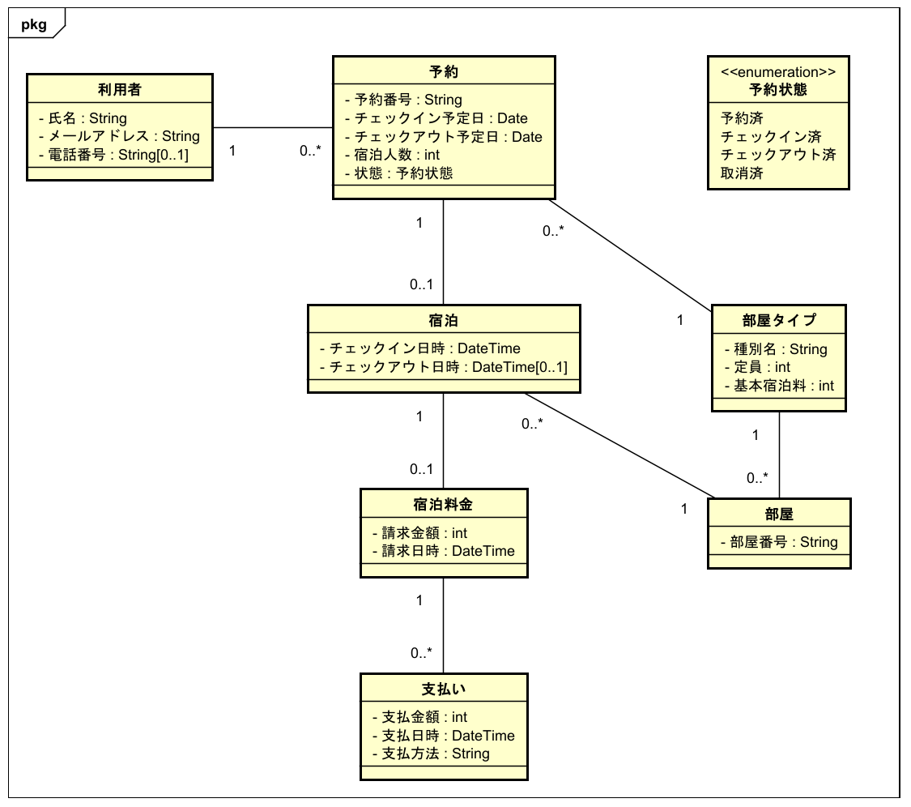
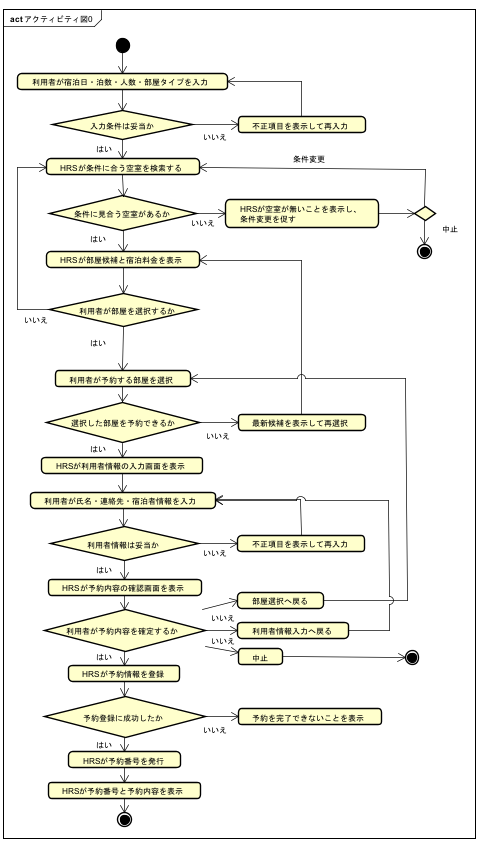
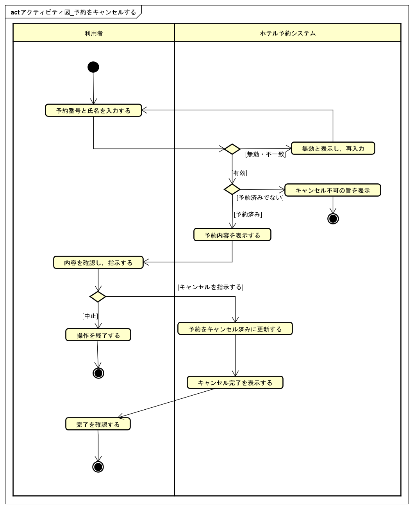
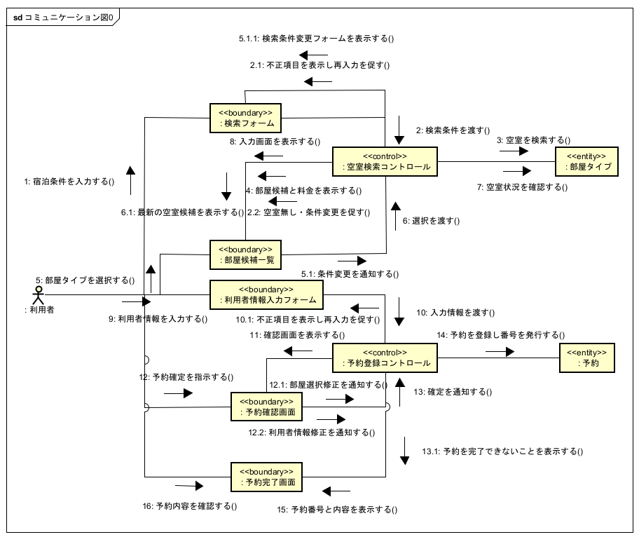

# Docs

- HRS の分析・設計成果物を管理
- Web アプリケーションは `src/`、DB 関連は `prisma/` に配置
- レビューは Pull Request または Issue、発表資料は必要になった時点で管理

## 構成

```text
docs/
├── analysis/
│   ├── domain/          # クラス図、オブジェクト図
│   ├── requirements/    # ユースケース、アクティビティ図、受入テスト
│   └── system/          # コラボレーション図、保守分析
├── design/              # 技術選定、画面、API、DB、テスト、デプロイ設計
├── README.md
└── *.pdf                # 公開許可と再配布権を確認済みの課題資料
```

## ドキュメントの読み順

| 順序 | 成果物 | 目的 |
| ---- | ------ | ---- |
| 1 | [クラス図](analysis/domain/class-diagram.md) | 問題領域の概念・属性・関係を把握する |
| 2 | [オブジェクト図](analysis/domain/object-diagram.md) | クラス図の多重度を具体値で検証する |
| 3 | [ユースケース図](analysis/requirements/usecase-diagram.md) | システムに期待される機能とアクターを把握する |
| 4 | 各ユースケース記述・アクティビティ図 | 各 UC の系列・事前条件・例外系列を把握する |
| 5 | [分析クラス図](analysis/system/analysis-class-diagram.md) | Boundary / Control / Entity の責務を把握する |
| 6 | 各コラボレーション図 | UC を実現するオブジェクト間のメッセージを把握する |
| 7 | [設計ドキュメント](design/) | 実装方針・API・DB・ルーティングを把握する |
| 8 | 保守記録（`analysis/system/*保守*`） | 変更の差分・影響範囲を把握する |

## 作業順序

| 順序 | 作業                                                    | 配置                     |
| ---- | ------------------------------------------------------- | ------------------------ |
| 1    | 問題領域の概念と関係を整理                              | `analysis/domain/`       |
| 2    | 利用者の目的とシステムの振る舞いを整理                  | `analysis/requirements/` |
| 3    | Boundary / Control / Entity の相互作用を整理            | `analysis/system/`       |
| 4    | 実装方式と責務を設計                                    | `design/`                |
| 5    | 成果物間の整合性を Pull Request または Issue でレビュー | GitHub                   |

## ファイル管理

| 対象       | 規則                                                      |
| ---------- | --------------------------------------------------------- |
| ファイル名 | 内容を識別できる名前にする                                |
| 日付       | 必要な場合だけ `YYYY-MM-DD` 形式を使う                    |
| 更新履歴   | 同じ成果物を更新し、履歴は Git で管理する                 |
| UML        | `.asta` を編集元、`.png` を閲覧用の出力として対で管理する |
| Markdown   | 図の説明、判断理由、レビュー結果を記録する                |
| 用語       | UML、ユースケース、設計、コードで統一する                 |
| 配布物     | 公開許可と再配布権を確認できたものだけを追加する          |

## 変更時の確認

- 関連する分析・設計資料と矛盾していない
- `.asta` と書き出した `.png` が一致している
- Markdown の相対リンクが有効
- 本索引と実際のファイル構成が一致している
- Public リポジトリに公開できる内容だけを含む
- 指摘には問題点、理由、修正案を含める

---

## ドメイン分析

HRS の問題領域に存在する概念、属性、関係を整理。実装技術ではなく、ホテル予約業務の用語を基準に記述し、クラス図を具体的なオブジェクト図で検証する。

| 成果物                                                          | 説明                                     | Astah                                                                     | 画像                                                                    |
| --------------------------------------------------------------- | ---------------------------------------- | ------------------------------------------------------------------------- | ----------------------------------------------------------------------- |
| [クラス図](analysis/domain/class-diagram.md)                    | 主要概念、属性、関連、多重度             | [class-diagram.asta](analysis/domain/class-diagram.asta)                  | [class-diagram.png](analysis/domain/class-diagram.png)                  |
| [オブジェクト図](analysis/domain/object-diagram.md)             | 具体的な宿泊シナリオによるクラス図の検証 | [object-diagram.asta](analysis/domain/object-diagram.asta)                | [object-diagram.png](analysis/domain/object-diagram.png)                |

### クラス図



### オブジェクト図


---

## 要求分析

HRS に期待される機能と振る舞いを整理する。ユースケース図・記述、アクティビティ図、受入テストを管理する。

| 成果物                                                                                                        | 説明                                              |
| ------------------------------------------------------------------------------------------------------------- | ------------------------------------------------- |
| [ユースケース図.png](analysis/requirements/ユースケース図.png)                                                | ユースケース図                                    |
| [usecase-diagram.md](analysis/requirements/usecase-diagram.md)                                                | ユースケース図の説明・アクター・スコープ          |
| [ユースケース記述_部屋を予約する.md](analysis/requirements/ユースケース記述_部屋を予約する.md)                | UC「部屋を予約する」のユースケース記述            |
| [アクティビティ図_部屋を予約する.png](analysis/requirements/アクティビティ図_部屋を予約する.png)              | UC「部屋を予約する」のアクティビティ図            |
| [ユースケース記述_予約を確認する.md](analysis/requirements/ユースケース記述_予約を確認する.md)                | UC「予約を確認する」のユースケース記述            |
| [アクティビティ図_予約を確認する.png](analysis/requirements/アクティビティ図_予約を確認する.png)              | UC「予約を確認する」のアクティビティ図            |
| [ユースケース記述_チェックインする.md](analysis/requirements/ユースケース記述_チェックインする.md)            | UC「チェックインする」のユースケース記述          |
| [アクティビティ図_チェックインする.png](analysis/requirements/アクティビティ図_チェックインする.png)          | UC「チェックインする」のアクティビティ図          |
| [ユースケース記述_チェックアウトする.md](analysis/requirements/ユースケース記述_チェックアウトする.md)        | UC「チェックアウトする」のユースケース記述        |
| [アクティビティ図_チェックアウトする.png](analysis/requirements/アクティビティ図_チェックアウトする.png)      | UC「チェックアウトする」のアクティビティ図        |
| [ユースケース記述_予約をキャンセルする.md](analysis/requirements/ユースケース記述_予約をキャンセルする.md)    | UC「予約をキャンセルする」のユースケース記述      |
| [アクティビティ図_予約をキャンセルする.png](analysis/requirements/アクティビティ図_予約をキャンセルする.png)  | UC「予約をキャンセルする」のアクティビティ図      |
| [acceptance-test-checklist.md](analysis/requirements/acceptance-test-checklist.md)                           | 受入テストの手動確認チェックリスト                |

### ユースケース図


### アクティビティ図 — 部屋を予約する



### アクティビティ図 — 予約を確認する


### アクティビティ図 — チェックインする


### アクティビティ図 — チェックアウトする


### アクティビティ図 — 予約をキャンセルする



---

## システム分析

ユースケースを実現する Boundary・Control・Entity と相互作用を整理する。コラボレーション図のメッセージを分析クラスの操作へ反映し、ドメイン分析・要求分析・実装との用語を統一する。

| 分類                 | Markdown                                                                                       | Astah                                                                                                                     | 画像                                                                                                                    |
| -------------------- | ---------------------------------------------------------------------------------------------- | ------------------------------------------------------------------------------------------------------------------------- | ----------------------------------------------------------------------------------------------------------------------- |
| 分析クラス図         | [analysis-class-diagram.md](analysis/system/analysis-class-diagram.md)                        | [analysis-class-diagram.asta](analysis/system/analysis-class-diagram.asta)                                                | [analysis-class-diagram.png](analysis/system/analysis-class-diagram.png)                                                |
| 部屋を予約する       | —                                                                                              | [コラボレーション図_部屋を予約する.asta](analysis/system/コラボレーション図_部屋を予約する.asta)                          | [コラボレーション図_部屋を予約する.png](analysis/system/コラボレーション図_部屋を予約する.png)                          |
| チェックインする     | [説明](analysis/system/コラボレーション図_チェックインする.md)                                 | [コラボレーション図_チェックインする.asta](analysis/system/コラボレーション図_チェックインする.asta)                      | [コラボレーション図_チェックインする.png](analysis/system/コラボレーション図_チェックインする.png)                      |
| チェックアウトする   | [説明](analysis/system/コラボレーション図_チェックアウトする.md)                               | [コラボレーション図_チェックアウトする.asta](analysis/system/コラボレーション図_チェックアウトする.asta)                  | [コラボレーション図_チェックアウトする.png](analysis/system/コラボレーション図_チェックアウトする.png)                  |
| 予約をキャンセルする | [保守記録](analysis/system/37_保守_予約キャンセル要求の追加対応.md)                            | [コラボレーション図_予約をキャンセルする.asta](analysis/system/コラボレーション図_予約をキャンセルする.asta)              | [コラボレーション図_予約をキャンセルする.png](analysis/system/コラボレーション図_予約をキャンセルする.png)              |

### 補足資料

| ファイル                                                                                             | 内容                              |
| ---------------------------------------------------------------------------------------------------- | --------------------------------- |
| [17_保守_UI-UX改善.md](analysis/system/17_保守_UI-UX改善.md)                                        | UI/UX改善による分析・設計への影響 |
| [37_保守_予約キャンセル要求の追加対応.md](analysis/system/37_保守_予約キャンセル要求の追加対応.md)  | 予約キャンセル追加時の差分        |

### 分析クラス図


### コラボレーション図 — 部屋を予約する



### コラボレーション図 — チェックインする


### コラボレーション図 — チェックアウトする


### コラボレーション図 — 予約をキャンセルする


---

## 設計

- 対象 Issue: [#15](https://github.com/97kuek/HRS/issues/15)
- 前提: [#23 技術スタック・API設計・DB設計の決定](design/tech-stack.md)

HRS を Next.js (App Router) / TypeScript / Prisma / PostgreSQL で実装する前提で、フロントエンド・バックエンド・データ層の責務と、分析成果物から実装モジュールへの対応を整理する。

### 詳細設計ドキュメント

| ドキュメント                                                                    | 内容                                                                 |
| ------------------------------------------------------------------------------- | -------------------------------------------------------------------- |
| [tech-stack.md](design/tech-stack.md)                                           | 技術スタック選定                                                     |
| [api-design.md](design/api-design.md)                                           | REST 風 API の共通方針、エンドポイント、リクエスト/レスポンス、エラー |
| [db-design.md](design/db-design.md)                                             | ER 構造、テーブル定義、制約、Prisma モデル案                         |
| [validation-error-design.md](design/validation-error-design.md)                 | 入力検証の責務分担、エラー形式、エラーコード                         |
| [transaction-concurrency-design.md](design/transaction-concurrency-design.md)   | 予約作成・チェックイン・チェックアウトのトランザクション境界と競合   |
| [ui-routing-design.md](design/ui-routing-design.md)                             | 利用者向け画面、画面遷移、CSR/SSR/SSG の使い分け                     |
| [deployment-environment-design.md](design/deployment-environment-design.md)     | 環境変数、環境分離、Prisma migration、デプロイ方針                   |
| [test-strategy.md](design/test-strategy.md)                                     | テスト戦略                                                           |
| [wireframes.md](design/wireframes.md)                                           | 画面ワイヤーフレーム                                                 |

### 設計方針

- Next.js App Router を採用し、画面と REST 風 API を同一アプリケーション内に置く
- UI、API、ユースケース処理、ドメインモデル、DB アクセスを分け、分析クラスの Boundary / Control / Entity に対応させる
- Prisma は DB アクセスの実装詳細として扱い、画面やユースケース処理から直接呼び出さない
- 予約番号の発行、予約状態の遷移、空室確認、料金計算などの業務ルールはアプリケーション層またはドメイン層に閉じ込める

### レイヤー責務

| レイヤー       | 主な配置                                          | 責務                                                                                         |
| -------------- | ------------------------------------------------- | -------------------------------------------------------------------------------------------- |
| フロントエンド | `app/**/page.tsx`, `components/**`                | 画面表示、フォーム入力、軽い入力チェック、API 呼び出し結果の表示                             |
| API 境界       | `app/api/**/route.ts`                             | HTTP リクエスト/レスポンスの変換、入力値の構文チェック、ステータスコードの決定               |
| アプリケーション層 | `lib/`                                        | ユースケース単位の処理手順、トランザクション境界、Repository の呼び出し                      |
| ドメイン層     | `lib/`                                            | 予約、部屋タイプ、部屋、宿泊、宿泊料金、支払いの業務ルールと状態遷移                         |
| データ層       | `prisma/`                                         | Prisma Client、PostgreSQL スキーマ、Repository 実装、DB 制約                                 |

### ドメイン概念と実装名

| ドメイン概念 | 実装名         | 主な責務                                           |
| ------------ | -------------- | -------------------------------------------------- |
| 利用者       | `Guest`        | 氏名、連絡先、予約者情報を保持する                 |
| 予約         | `Reservation`  | 予約番号、宿泊予定、人数、状態、希望部屋タイプを保持する |
| 予約状態     | `ReservationStatus` | `RESERVED`, `CHECKED_IN`, `CHECKED_OUT`, `CANCELLED` |
| 部屋タイプ   | `RoomType`     | 種別名、定員、基本宿泊料を保持する                 |
| 部屋         | `Room`         | 部屋番号、部屋タイプへの所属を保持する             |
| 宿泊         | `Stay`         | チェックイン/チェックアウト実績と割当部屋を保持する |
| 宿泊料金     | `LodgingCharge`| 宿泊に対する請求金額を保持する                     |
| 支払い       | `Payment`      | 支払金額、支払日時、支払方法を保持する             |
