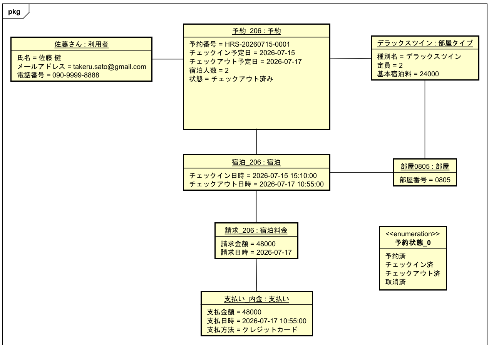

# ドメイン分析: オブジェクト図

- クラス図の型・関連・多重度を具体的な宿泊シナリオで検証
- 対象Issue: #2、#12
- 作図ツール: Astah

## 検証シナリオ

- 利用者: 佐藤 健
- 部屋タイプ: デラックスツイン
- 宿泊人数: 2名
- 宿泊期間: 2026-07-15から2026-07-17までの2泊
- 割当部屋: 0805
- 宿泊料金: 24,000円 × 2泊 = 48,000円
- 支払い: クレジットカードで48,000円
- 最終状態: チェックアウト済み

## オブジェクト図

## オブジェクトと具体値

| オブジェクト                 | 主な値                                                              |
| ---------------------------- | ------------------------------------------------------------------- |
| 佐藤さん: 利用者             | 氏名=`佐藤 健`、メールアドレス、電話番号                            |
| 予約\_206: 予約              | 予約番号=`HRS-20260715-0001`、宿泊人数=`2`、状態=`チェックアウト済` |
| デラックスツイン: 部屋タイプ | 定員=`2`、基本宿泊料=`24000`                                        |
| 部屋0805: 部屋               | 部屋番号=`0805`                                                     |
| 宿泊\_206: 宿泊              | チェックイン日時とチェックアウト日時                                |
| 請求\_206: 宿泊料金          | 請求金額=`48000`、請求日=`2026-07-17`                               |
| 支払い: 支払い               | 支払金額=`48000`、支払方法=`クレジットカード`                       |

## クラス図との照合

| 確認項目         | 結果                                         |
| ---------------- | -------------------------------------------- |
| 利用者と予約     | 1人の利用者に予約を関連付けられる            |
| 予約と部屋タイプ | 予約時にデラックスツインを指定できる         |
| 予約と宿泊       | チェックイン後に1件の宿泊を作成できる        |
| 宿泊と部屋       | 宿泊に0805号室を割り当てられる               |
| 宿泊と宿泊料金   | チェックアウト時に48,000円の料金を作成できる |
| 宿泊料金と支払い | 宿泊料金に対して支払いを記録できる           |
| 予約状態         | チェックアウト完了後の状態を表現できる       |

## 結論

- シナリオに必要な全Entityをクラス図で表現できる
- 具体値は属性の型と多重度を満たす
- 予約時の部屋タイプ指定とチェックイン時の部屋割当を区別できる
- 宿泊料金と支払いを分離して記録できる
