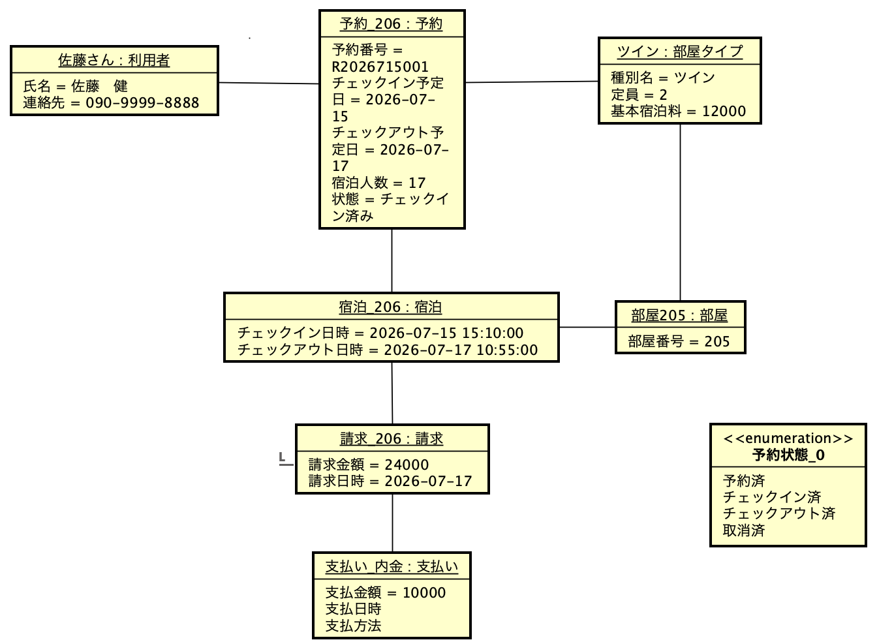

# ドメイン分析: オブジェクト図（クラス図の検証）

クラス図 (`class-diagram.md` / `クラス図.png`) の妥当性を、具体的なシナリオから作成したオブジェクト図で検証した資料です。

- 対象 Issue: #2 / 検証対象: #1 のクラス図
- 状態: **ドラフト**（#3 のレビューへ）
- 作図ツール: **Astah**。正本は `object-diagram.asta`（図は `オブジェクト図.png` に書き出す）

## 検証に使用したシナリオ

利用者「佐藤 健一」が「ツインルーム」を2泊で予約。本日（2026/07/15）ホテルに到着してチェックインし、205号室を割り当てられた。その際、総額 24,000 円の請求のうち、10,000 円を内金（デポジット）としてクレジットカードで支払った。

「宿泊」「支払い」等の全クラスが具体化されるリッチなシナリオを意図的に選び、クラス図のデータ構造で表現できるかを照合した。

## オブジェクト図

## クラス図との照合結果

| 確認した構造 | クラス図の定義 | 結果 |
| --- | --- | --- |
| 宿泊 ―― 部屋 の関連 | `宿泊 0..* ―― 1 部屋` | チェックイン時に特定の部屋（205号室）を宿泊データに結びつける振る舞いを保持できることを確認 |
| 請求 ―― 支払い の多重度 | `宿泊料金 1 ―― 0..* 支払い` | 24,000 円の請求に対しまず 10,000 円の内金を支払う部分払いを表現できることを確認 |

## 結論

シナリオ中の各概念がクラス図のクラス・関連・多重度に過不足なく対応し、クラス図が問題領域のデータ構造を満たしていることを確認した。詳細なレビューは #3 で実施する。
