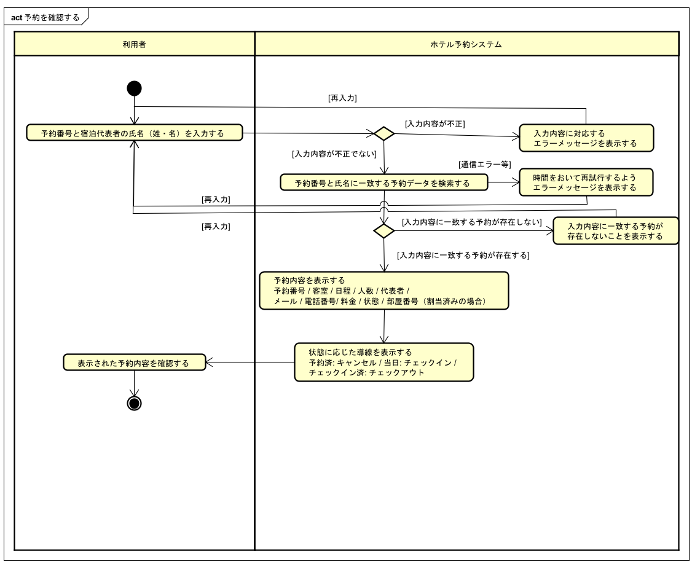

# ユースケース記述: 予約を確認する

## 概要

| 項目 | 内容 |
| --- | --- |
| ユースケース名 | 予約を確認する |
| 主アクター | 利用者 |
| 関係者 | なし（セルフサービス前提） |
| 目的 | 利用者が予約番号と宿泊代表者の氏名から自身の予約内容を確認できる |
| 事前条件 | 予約が完了し、予約番号が発行されている |
| 事後条件 | 利用者が予約内容を確認できている |
| 失敗時の事後条件 | 予約内容は表示されず、利用者に入力内容に一致する予約が無いことが示されている |

## 基本系列

1. 利用者が予約確認ページ（`/reservations/lookup`）を開く。
2. HRSが予約番号と宿泊代表者の氏名（姓・名）の入力フォームを表示する。
3. 利用者が予約番号と宿泊代表者の氏名（姓・名）を入力し、照会を指示する。
4. HRSが入力内容と一致する予約を検索する。
5. HRSが該当する予約内容（予約番号、部屋タイプ、割当済みの場合は部屋番号、宿泊日程、宿泊人数、代表者名、メールアドレス、電話番号、料金、ステータス等）を表示する。
6. 利用者が表示された予約内容を確認する。

## 代替系列

なし

## 例外系列

### E1: 入力内容が不正である

3a. HRSが予約番号の形式不正、または氏名（姓・名）の未入力を検出する。
3b. HRSが入力内容に対応するエラーメッセージを表示する。
3c. ユースケースは基本系列3に戻る。

### E2: 入力内容に一致する予約が存在しない

4a. HRSが入力された予約番号と氏名に該当する予約データが存在しないことを検出する。
4b. HRSがエラーメッセージを表示する。
4c. ユースケースは基本系列3に戻る。

### E3: 予約照会処理を完了できない

4a. HRSが予約照会処理中のエラーを検出する。
4b. HRSが時間をおいて再試行するよう促すエラーメッセージを表示する。
4c. ユースケースは基本系列3に戻る。

## アクティビティ図

> **注**: アクティビティ図の「予約番号と宿泊代表者の氏名（姓名）を入力する」アクションは、実装では**予約番号・姓・名の3フィールドの入力**に対応する。例外系列 E1 は入力エラー判定、E2 は入力内容に一致する予約が存在しない場合に対応する。

## 補足

- 「入力内容に一致する予約が存在しない場合」は目的を達成できずに終わる振る舞いのため、代替系列ではなく**例外系列**として定義した。
- 予約番号のみでなく宿泊代表者の氏名（姓・名）も照合することで、第三者が予約番号を知っていても内容を参照できないようにしている（本人照合）。キャンセル・チェックインの各 UC も同様の方針を採用している。
- 現行実装では、予約照会結果として代表者名、メールアドレス、任意入力の電話番号も表示している。電話番号は予約時に未入力の場合は表示しない。
- 予約に部屋番号が割り当てられている場合は、照会結果に部屋番号を表示する。予約済みでチェックイン日がホテル所在地の当日の場合は「チェックインへ進む」を表示し、予約済みの場合は「この予約をキャンセルする」を表示する。チェックイン済みの場合は「チェックアウトへ進む」を表示する。
- 作図ツール: **Astah**。正本は `activity-diagram-confirm-reservation.asta`（図は同名 `.png` に書き出す）。
