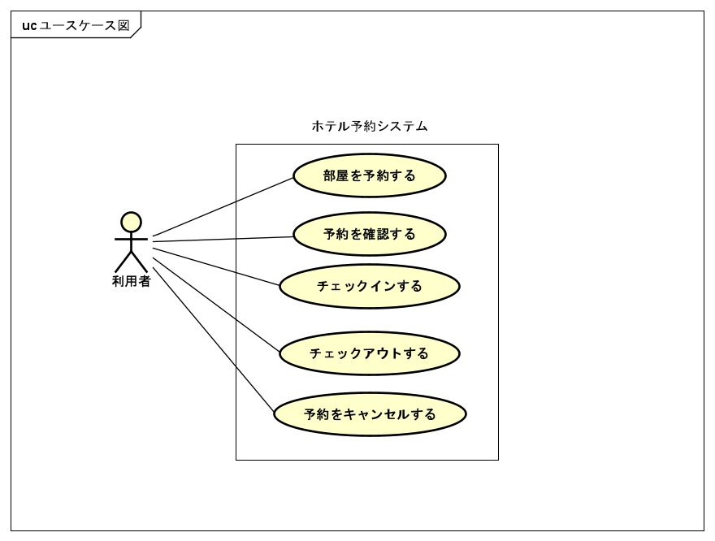

# 要求分析: ユースケース図

HRS (ホテル予約システム) に期待される機能と，それに関わるアクターを整理したユースケース図である．ドメイン分析 (#1) で得た問題領域を踏まえ，利用者がシステムに対して行うまとまった振る舞いを特定する．

- 対象 Issue: #4 / 元にした業務フロー: `docs/チーム開発1.pdf` p.12
- 状態: **ドラフト**（チームレビュー → 修正を想定）
- 作図ツール: **Astah**．正本は `usecase-diagram.asta`（図は `ユースケース図.png` に書き出す）
- システム境界: **ホテル予約システム（HRS）**

## アクター

| アクター | 説明 |
| --- | --- |
| 利用者 | 部屋を予約し宿泊する人．Webアプリ上で予約・確認・チェックイン・チェックアウトを自身で操作する． |

ドメイン分析で受付係をモデルから外し，利用者がセルフサービスで操作する前提としたため，主アクターは**利用者のみ**である．担当受付係を記録・操作する要件が出た場合は，アクターの追加を再検討する．

## ユースケース一覧

確定スコープとして，対応する記述担当 Issue があるユースケースを5つ挙げる．

| ユースケース | 対応 Issue | 説明 |
| --- | --- | --- |
| 部屋を予約する | #5, #9 | 利用者が部屋タイプ・期間・人数を指定し，予約を確保する． |
| 予約を確認する | #25 | 利用者が予約番号などから自身の予約内容と状態を確認する． |
| チェックインする | #6, #10 | 利用者が予約に基づき入館手続きを行い，部屋の割り当てを受ける． |
| チェックアウトする | #7, #11 | 利用者が退館手続きを行い，宿泊を終了する． |
| 予約をキャンセルする | #37, #45 | 利用者が自身の予約を取り消し，予約をキャンセル済みにする． |

## 関連

利用者と各ユースケースを関連で結ぶ．いずれも利用者が主体となって開始する振る舞いである．

| アクター | 関連 | ユースケース |
| --- | --- | --- |
| 利用者 | ─ | 部屋を予約する |
| 利用者 | ─ | 予約を確認する |
| 利用者 | ─ | チェックインする |
| 利用者 | ─ | チェックアウトする |
| 利用者 | ─ | 予約をキャンセルする |

## 用語表

| ユースケース | 一行説明 |
| --- | --- |
| 部屋を予約する | 希望する部屋タイプ・期間・人数で予約を作成し，予約番号を発行する． |
| 予約を確認する | 既存の予約の内容と予約状態を参照する． |
| チェックインする | 予約済みの予約を入館により成立させ，具体的な部屋を割り当てる． |
| チェックアウトする | 滞在を終了し，宿泊を完了状態にする． |
| 予約をキャンセルする | 予約済みの予約をキャンセル済みにし，該当部屋タイプの在庫を回復させる． |

## スコープ未確定事項 (チームで要確認)

確定スコープには含めていないが，扱いを決める必要がある候補である．記述担当 Issue の有無やドメイン分析との整合を踏まえ，チームで判断する．

- **空室を検索する**: 「部屋を予約する」の前段にあたる振る舞い．独立したユースケースとするか，「部屋を予約する」に含めるかを決める．
- **料金を支払う／外部決済システム**: 支払いはドメイン分析でも独立した概念である．「チェックアウトする」に含めるか，別ユースケース（および外部決済システムをアクターとして扱うか）として切り出すかを決める．

## レビュー観点

- [ ] 要求される機能と関係するアクターが網羅されている
- [ ] 抽象的な機能名だけでなく，具体的な振る舞いになっている
- [ ] ユースケース名が現在時制かつ能動態の動詞句になっている
- [ ] アクターは関わるユースケースとのみ関連づけられている
- [ ] システム境界が明確である
- [ ] スコープ未確定事項がチームで合意されている
