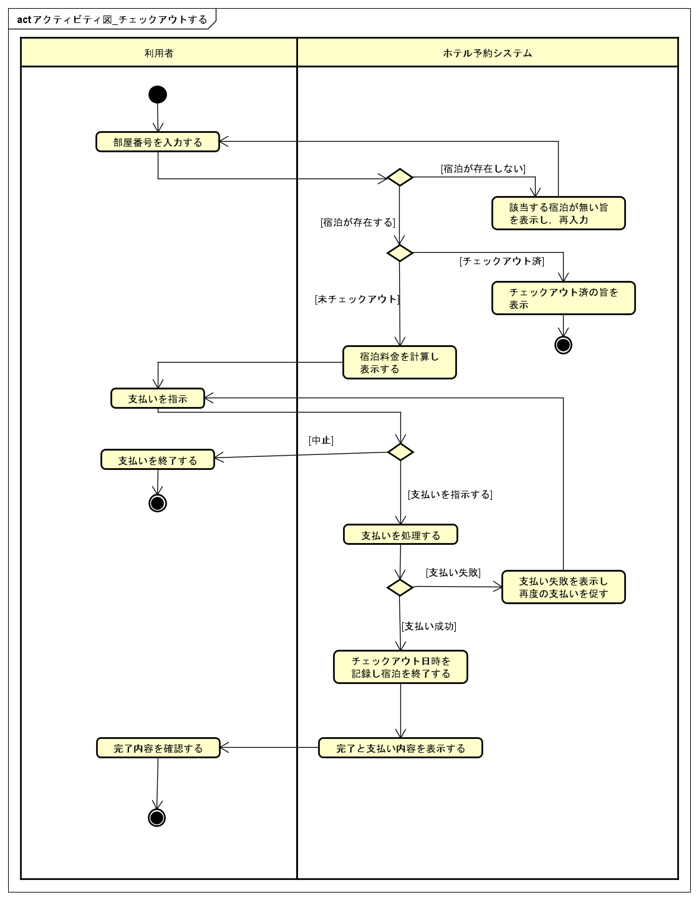

# ユースケース記述: チェックアウトする

## 概要

| 項目 | 内容 |
| --- | --- |
| ユースケース名 | チェックアウトする |
| 主アクター | 利用者 |
| 関係者 | なし（セルフサービス前提。ホテルスタッフはシステムに直接関与しない） |
| 目的 | 利用者が宿泊を終了し，宿泊料金を支払ってチェックアウトする |
| 事前条件 | HRSが利用可能であり，利用者がチェックイン済みの宿泊を保有している |
| 事後条件 | 宿泊が終了し，HRSにチェックアウト日時と支払いが記録され，利用者に領収メールが送信されている |
| 失敗時の事後条件 | 宿泊は終了せず，支払いは記録されない。利用者にチェックアウトできない理由が示されている |

## 基本系列

1. 利用者が部屋番号を入力する。
2. HRSが部屋番号に対応する宿泊を特定する。
3. HRSが宿泊料金（宿泊日数と部屋タイプに基づく金額）を計算し，表示する。
4. 利用者が支払い方法を選択し，支払いを指示する。
5. HRSが支払いを処理する。
6. HRSがチェックアウト日時を記録し，宿泊を終了する。
7. HRSがチェックアウト完了と支払い内容を表示する。
8. HRSが利用者のメールアドレスに領収メールを送信する。

## 代替系列

### A1: 利用者が支払いを取りやめる

4a. 利用者が宿泊料金を確認し，支払いの中止を指示する。  
4b. HRSは支払いを処理せず，チェックアウト操作を終了する。

## 例外系列

### E1: 部屋番号に対応する宿泊が存在しない

2a. HRSが入力された部屋番号に対応するチェックイン済みの宿泊を見つけられない。  
2b. HRSが該当する宿泊が存在しないことを表示し，再入力を促す。  
2c. ユースケースは基本系列1に戻る。

### E2: 既にチェックアウト済みである

2a. HRSが対象の宿泊が既にチェックアウト済みであることを検出する。  
2b. HRSが既にチェックアウト済みであることを表示する。  
2c. HRSはチェックアウト日時を新たに記録せず，チェックアウト操作を終了する。

### E3: 支払いに失敗する

5a. HRSが支払いの処理に失敗する。  
5b. HRSが支払いに失敗したことを表示し，再度の支払いを促す。  
5c. ユースケースは基本系列4に戻る。

## アクティビティ図

## 補足

- 支払い方法は**現金**・**クレジットカード**から選択する（実際の決済処理はシステム外）。
- 領収メール（基本系列8）はメール送信サービスの障害時もチェックアウト処理を妨げない非同期送信で行う。送信が失敗した場合でもチェックアウトは完了している。
