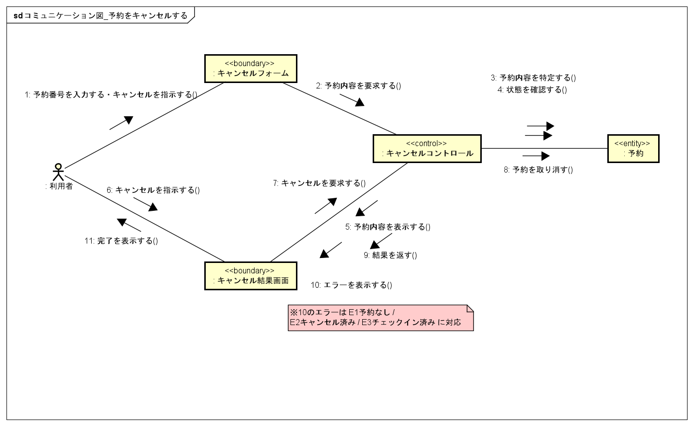

# 保守: 予約キャンセル要求の追加対応

- 対象 Issue: #37（[Ex6] 保守: 予約キャンセル要求の追加対応）
- 関連実装: #45（UC「予約をキャンセルする」の実装）
- 担当: Tomuzou

## 1. 概要

- 保守課題: 「利用者が予約をキャンセルできる」という要求への対応
- 技術スタック: Next.js / TypeScript / Prisma / PostgreSQL（既存に従う）

## 2. 要求分析の差分

### 2.1 ユースケース図

「予約をキャンセルする」は分析フェーズで既にスコープ内と確定していたため，ユースケース図の構造上の変更は生じない（アクターは利用者，セルフサービス）．本対応では，未整備であったユースケース記述とシステム分析成果物を補った．

### 2.2 ユースケース記述（新規）

| 項目 | 内容 |
| --- | --- |
| ユースケース名 | 予約をキャンセルする |
| 主アクター | 利用者 |
| 事前条件 | 利用者がキャンセル可能な予約（予約済みの状態）を保有している |
| 事後条件 | 予約がキャンセル済みとなり，該当部屋タイプの在庫が回復している |
| 失敗時 | 予約は変更されず，キャンセルできない理由が示されている |

基本系列:

1. 利用者が予約番号を入力する．
2. HRS が予約を特定し，予約内容を表示する．
3. 利用者が内容を確認し，キャンセルを指示する．
4. HRS が予約をキャンセル済みに更新する．
5. HRS がキャンセル完了を表示する．

代替系列 A1（キャンセルの中止）: 手順3で利用者が予約内容を確認し，中止を指示する．HRS は予約を変更せず操作を終了する．

例外系列:
- E1 予約が存在しない: 予約番号に対応する予約が見つからない旨を表示し，再入力を促す．
- E2 既にキャンセル済み: 既にキャンセルされている旨を表示する．
- E3 チェックイン済み: チェックイン済みの予約はキャンセルできない旨を表示する．

## 3. システム分析の差分

### 3.1 コラボレーション図（新規）

キャンセルのコラボレーション図を新規に作成した（`コラボレーション図_予約をキャンセルする.png`）。
予約内容の表示（照会）とキャンセルの確定を分ける2フェーズ構成であり，チェックアウトのコラボレーション図（#11）と同じ構造をとる．中心となるエンティティは「予約」のみである．

### 3.2 クラス図・ドメインモデル

**変更なし．** 予約の状態を表す列挙に「キャンセル済み」が既に存在し，新規のエンティティ・属性・関連は不要であった．キャンセルは既存の予約エンティティの状態遷移（予約済み → キャンセル済み）として表現できる．

## 4. アーキテクチャ設計・実装への影響

変更は上位層に閉じており，ドメインモデルと共通基盤には及ばなかった．

| 層 | 変更 |
| --- | --- |
| プレゼンテーション層 | キャンセル画面を追加（`src/app/reservations/cancel/page.tsx`） |
| アプリケーション層 | 照会 API・確定 API・キャンセル判定の純関数を追加 |
| ドメイン（Prisma schema） | 変更なし |
| 共通基盤（APIエラー定義） | 変更なし（既存のエラーコードで充足） |

追加したファイル:
- `src/lib/reservations/cancellation.ts` … キャンセル可否判定の純ドメイン関数
- `src/app/api/reservations/[reservationNumber]/cancel/quote/route.ts` … 予約内容の照会（GET・未確定）
- `src/app/api/reservations/[reservationNumber]/cancel/route.ts` … キャンセル確定（POST）
- `src/app/reservations/cancel/page.tsx` … キャンセル画面

例外コードは既存の `RESERVATION_NOT_FOUND` / `INVALID_RESERVATION_STATUS` を使用し，新規追加はない．

## 5. 実装後の動作確認

ローカル環境（Neon 開発DB）で確認した．

| ケース | 結果 |
| --- | --- |
| 正常系: 予約済みの予約をキャンセル | 完了・状態がキャンセル済みに更新 |
| E2 既にキャンセル済み: 再照会 | 「既にキャンセルされています」と表示，確定不可 |
| E1 存在しない予約番号 | 「見つかりません」と表示 |

## 6. 変更による影響の考察

- **変更の局所性**: 変更はプレゼンテーション層とアプリケーション層に閉じ，ドメインモデルと共通基盤には及ばなかった。キャンセル済みという状態が分析段階から想定されており，既存の状態遷移として表現できた
- **在庫の整合**: 在庫は予約済み・チェックイン済みの集計で判定しており，キャンセル済みは集計対象外である。キャンセルにより該当部屋タイプの在庫が自動的に回復するため，追加処理は不要であった
- **同時実行**: キャンセル確定は状態が予約済みであることを条件とする条件付き更新で行う。照会からキャンセル確定までの間に別処理（チェックイン等）が割り込んでも不整合な状態遷移を防げる。分離レベルに起因する残余リスクはコース規模として許容している（予約・チェックインと同方針）
- **設計の効果**: 安定した下位層（ドメイン）を変更せずに上位層の追加のみで実現できた。保守対応の波及範囲が小さく収まった
