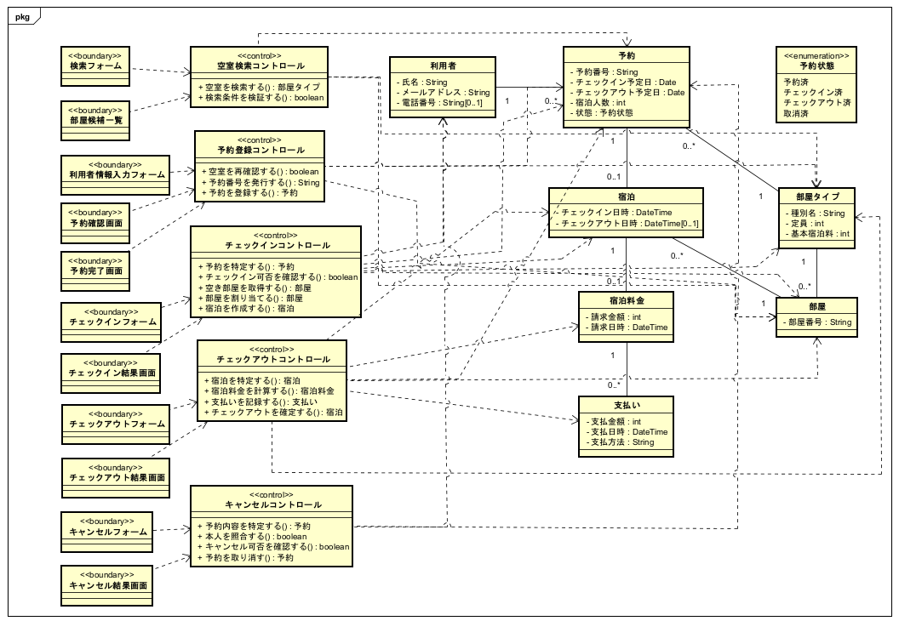

# システム分析: 分析クラス図

- 対象Issue: #12
- 作図ツール: Astah
- 対象ユースケース: 予約、チェックイン、チェックアウト、予約キャンセル

## 分析クラス図

## Boundary

| ユースケース   | Boundary                                                                       |
| -------------- | ------------------------------------------------------------------------------ |
| 予約           | 検索フォーム、部屋候補一覧、利用者情報入力フォーム、予約確認画面、予約完了画面 |
| チェックイン   | チェックインフォーム、チェックイン結果画面                                     |
| チェックアウト | チェックアウトフォーム、チェックアウト結果画面                                 |
| 予約キャンセル | キャンセルフォーム、キャンセル結果画面                                         |

## Controlと操作

| Control                    | 操作                       | 戻り値     |
| -------------------------- | -------------------------- | ---------- |
| 空室検索コントロール       | 空室を検索する             | 部屋タイプ |
| 空室検索コントロール       | 検索条件を検証する         | `boolean`  |
| 予約登録コントロール       | 空室を再確認する           | `boolean`  |
| 予約登録コントロール       | 予約番号を発行する         | `String`   |
| 予約登録コントロール       | 予約を登録する             | 予約       |
| チェックインコントロール   | 予約を特定する             | 予約       |
| チェックインコントロール   | チェックイン可否を確認する | `boolean`  |
| チェックインコントロール   | 空き部屋を取得する         | 部屋       |
| チェックインコントロール   | 部屋を割り当てる           | 部屋       |
| チェックインコントロール   | 宿泊を作成する             | 宿泊       |
| チェックアウトコントロール | 宿泊を特定する             | 宿泊       |
| チェックアウトコントロール | 宿泊料金を計算する         | 宿泊料金   |
| チェックアウトコントロール | 支払いを記録する           | 支払い     |
| チェックアウトコントロール | チェックアウトを確定する   | 宿泊       |
| キャンセルコントロール     | 予約内容を特定する         | 予約       |
| キャンセルコントロール     | 本人を照合する             | `boolean`  |
| キャンセルコントロール     | キャンセル可否を確認する   | `boolean`  |
| キャンセルコントロール     | 予約を取り消す             | 予約       |

## 依存関係

| Control                    | 依存するEntity                                 |
| -------------------------- | ---------------------------------------------- |
| 空室検索コントロール       | 予約、部屋タイプ、部屋                         |
| 予約登録コントロール       | 利用者、予約、部屋タイプ                       |
| チェックインコントロール   | 利用者、予約、部屋タイプ、部屋、宿泊           |
| チェックアウトコントロール | 予約、部屋タイプ、部屋、宿泊、宿泊料金、支払い |
| キャンセルコントロール     | 利用者、予約                                   |

## 表記方針

- BoundaryからControl、ControlからEntityへ依存線を引く
- 依存線には多重度を付けない
- Entity間の関連と多重度はドメインクラス図を基準とする
- `予約状態`は列挙型として予約の状態属性から参照する
- Controlの操作はコラボレーション図のメッセージと対応させる
