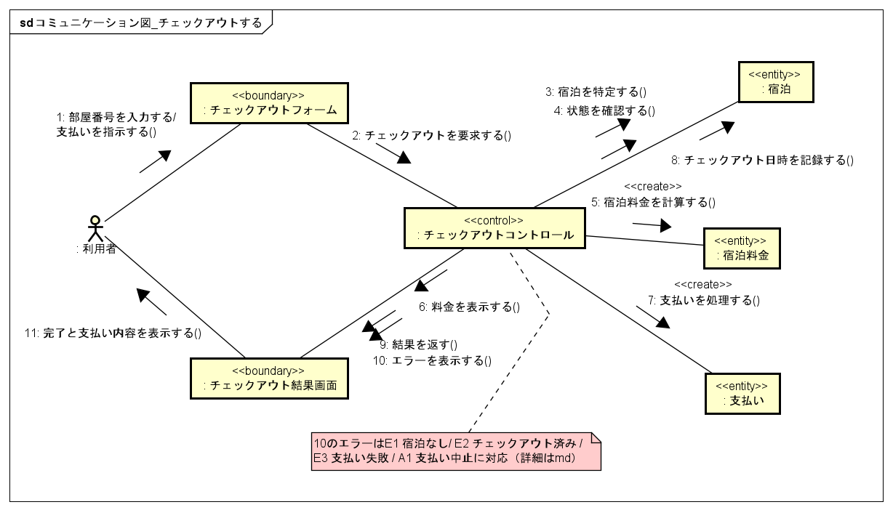

# コラボレーション図: チェックアウトする

- 対象ユースケース: チェックアウトする（#7）
- 対象Issue: #11

## 関与クラス（ロバストネス分析）

| 分類 | クラス | 役割 |
| --- | --- | --- |
| «boundary» | チェックアウトフォーム | 部屋番号の入力と支払いの指示を受け付ける |
| «boundary» | チェックアウト結果画面 | 完了・支払い内容またはエラーを表示する |
| «control» | チェックアウトコントロール | 宿泊特定，料金計算，支払い処理，チェックアウト記録を制御する |
| «entity» | 宿泊 | 部屋番号で特定し，状態を確認し，チェックアウト日時を記録する |
| «entity» | 宿泊料金 | 宿泊日数と部屋タイプに基づいて計算し，生成する |
| «entity» | 支払い | 支払いを処理し，記録する |

## メッセージとユースケース記述の対応

| No. | メッセージ | 基本系列 |
| --- | --- | --- |
| 1 | 部屋番号を入力する／支払いを指示する | 1, 4 |
| 2 | チェックアウトを要求する | 4 |
| 3 | 宿泊を特定する | 2 |
| 4 | 状態を確認する | 2 |
| 5 | 宿泊料金を計算する（«create»） | 3 |
| 6 | 料金を表示する | 3 |
| 7 | 支払いを処理する（«create»） | 5 |
| 8 | チェックアウト日時を記録する | 6 |
| 9 | 結果を返す | 7 |
| 11 | 完了と支払い内容を表示する | 7 |

## エラー表示（メッセージ10）と代替・例外系列の対応

メッセージ10「エラーを表示する」は，ユースケース記述の以下の系列に対応する．

- E1: 部屋番号に対応する宿泊が存在しない
- E2: 既にチェックアウト済みである
- E3: 支払いに失敗する
- A1: 利用者が支払いを取りやめる

## 図

