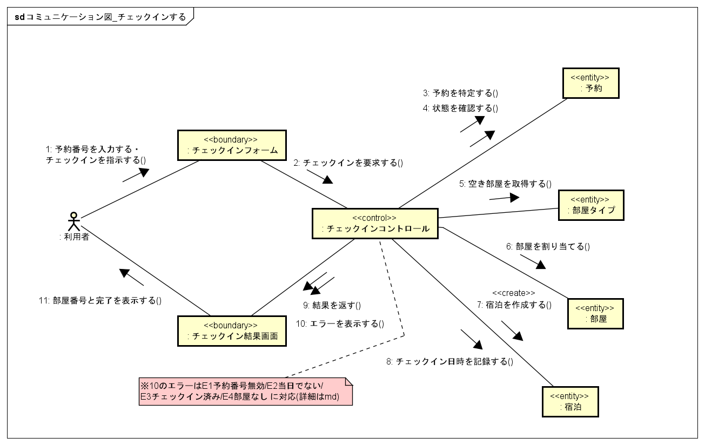

# コラボレーション図: チェックインする

- 対象ユースケース: チェックインする（#6）
- 対象Issue: #10

## 関与クラス（ロバストネス分析）

| 分類 | クラス | 役割 |
| --- | --- | --- |
| «boundary» | チェックインフォーム | 予約番号の入力とチェックインの指示を受け付ける |
| «boundary» | チェックイン結果画面 | 部屋番号・完了またはエラーを表示する |
| «control» | チェックインコントロール | 予約確認，部屋割当，宿泊記録を制御する |
| «entity» | 予約 | 予約番号で特定し，状態を確認する |
| «entity» | 部屋タイプ | 予約された部屋タイプの空き部屋を取得する |
| «entity» | 部屋 | 空いている実部屋を割り当てる |
| «entity» | 宿泊 | 新規に作成し，チェックイン日時を記録する |

## メッセージとユースケース記述の対応

| No. | メッセージ | 基本系列 |
| --- | --- | --- |
| 1 | 予約番号を入力する／チェックインを指示する | 1, 4 |
| 2 | チェックインを要求する | 4 |
| 3 | 予約を特定する | 2 |
| 4 | 状態を確認する | 2 |
| 5 | 空き部屋を取得する | 5 |
| 6 | 部屋を割り当てる | 5 |
| 7 | 宿泊を作成する（«create»） | 6 |
| 8 | チェックイン日時を記録する | 6 |
| 9 | 結果を返す | 7 |
| 11 | 部屋番号と完了を表示する | 7 |

## エラー表示（メッセージ10）と例外系列の対応

メッセージ10「エラーを表示する」は，ユースケース記述の以下の例外系列に対応する．

- E1: 予約番号が無効である
- E2: 当日がチェックイン可能日でない
- E3: 予約が既にチェックイン済みである
- E4: 割り当て可能な部屋がない

## 図

## Astah 更新メモ

以下の点が実装と乖離しているため、Astah ファイル（`.asta`）および `.png` の更新が望ましい。

- **メッセージ1**：「予約番号を入力する」→「予約番号・姓・名を入力する」に変更する。チェックインの本人照合は予約番号＋氏名（姓・名）で行うため。
- **«boundary» チェックインフォーム**：「予約番号の入力とチェックインの指示を受け付ける」→「予約番号・姓・名の入力とチェックインの指示を受け付ける」に変更する。
- **E1 例外系列**：「予約番号が無効である」→「予約番号が存在しない、または氏名が一致しない」に変更する（氏名照合失敗も同じ E1 で扱うため）。
