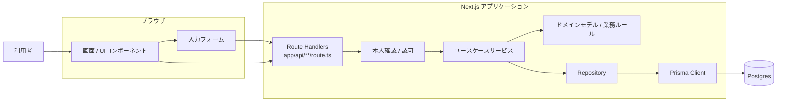

# アーキテクチャ設計

- 対象 Issue: [#15](https://github.com/97kuek/HRS/issues/15)
- 前提: [#23 技術スタック・API設計・DB設計の決定](../tech-stack/README.md)
- 状態: **ドラフト**（[#14 システム分析レビュー](https://github.com/97kuek/HRS/issues/14) が未完了のため、レビュー後に見直す）

HRS (ホテル予約システム) を Next.js (App Router) / TypeScript / Prisma / Postgres で実装する前提で、フロントエンド、バックエンド、データ層の責務と、分析成果物から実装モジュールへの対応を整理する。

## 設計方針

- Next.js App Router を採用し、画面と REST 風 API を同一アプリケーション内に置く。
- UI、API、ユースケース処理、ドメインモデル、DBアクセスを分け、分析クラスの Boundary / Control / Entity に対応させる。
- Prisma は DBアクセスの実装詳細として扱い、画面やユースケース処理から直接呼び出さない。
- 予約番号の発行、予約状態の遷移、空室確認、料金計算などの業務ルールはアプリケーション層またはドメイン層に閉じ込める。
- 文書上の用語はドメイン分析の日本語名を正とし、実装名は対応表で固定する。

## 詳細設計

| ドキュメント | 内容 |
| --- | --- |
| [API設計](api-design.md) | REST風APIの共通方針、エンドポイント、リクエスト/レスポンス、エラー |
| [DB設計](db-design.md) | ER構造、テーブル定義、制約、Prismaモデル案 |
| [認証・認可設計](auth-design.md) | 利用者本人確認、予約単位の認可、将来のログイン/ロール設計方針 |

## コンポーネント図



## レイヤー責務

| レイヤー | 主な配置 | 責務 |
| --- | --- | --- |
| フロントエンド | `app/**/page.tsx`, `components/**` | 利用者への画面表示、フォーム入力、クライアント側でできる軽い入力チェック、API呼び出し結果の表示 |
| API境界 | `app/api/**/route.ts` | HTTPリクエスト/レスポンスの変換、入力値の構文チェック、ステータスコードの決定 |
| アプリケーション層 | `features/**/application/**` または `lib/application/**` | ユースケース単位の処理手順、トランザクション境界、Repositoryの呼び出し |
| ドメイン層 | `features/**/domain/**` または `lib/domain/**` | 予約、部屋タイプ、部屋、宿泊、宿泊料金、支払いの業務ルールと状態遷移 |
| データ層 | `features/**/infrastructure/**`, `lib/db/**`, `prisma/**` | Prisma Client、Postgresスキーマ、Repository実装、DB制約 |

## 想定ディレクトリ構成

```text
.
├── app/
│   ├── reservations/
│   │   ├── new/page.tsx
│   │   └── [reservationNumber]/page.tsx
│   ├── check-in/page.tsx
│   ├── check-out/page.tsx
│   └── api/
│       ├── room-types/route.ts
│       ├── availability/route.ts
│       ├── reservations/route.ts
│       ├── reservations/lookup/route.ts
│       ├── reservations/[reservationNumber]/
│       │   ├── check-in/route.ts
│       │   └── check-out/route.ts
├── components/
├── features/
│   ├── reservation/
│   │   ├── application/
│   │   ├── domain/
│   │   └── infrastructure/
│   ├── check-in/
│   └── check-out/
├── lib/
│   └── db/
└── prisma/
    └── schema.prisma
```

実装開始時に Next.js の `src/` 配置を採用する場合は、上記の `app/`, `components/`, `features/`, `lib/` を `src/` 配下に移す。どちらにしてもレイヤー責務は変えない。

## API設計概要

予約、予約確認、チェックイン、チェックアウトを REST 風 API として提供する。Route Handler は HTTP と JSON の境界に限定し、空室確認や状態遷移などの業務ルールはユースケースサービスに委譲する。

詳細は [API設計](api-design.md) に記載する。

## ドメイン概念と実装名

| ドメイン概念 | 実装名候補 | 主な責務 |
| --- | --- | --- |
| 利用者 | `Guest` | 氏名、連絡先、予約者情報を保持する |
| 予約 | `Reservation` | 予約番号、宿泊予定、人数、状態、希望部屋タイプを保持する |
| 予約状態 | `ReservationStatus` | `RESERVED`, `CHECKED_IN`, `CHECKED_OUT`, `CANCELLED` を表す |
| 部屋タイプ | `RoomType` | 種別名、定員、基本宿泊料を保持する |
| 部屋 | `Room` | 部屋番号、部屋タイプへの所属を保持する |
| 宿泊 | `Stay` | チェックイン/チェックアウト実績と割当部屋を保持する |
| 宿泊料金 | `LodgingCharge` | 宿泊に対する請求金額を保持する |
| 支払い | `Payment` | 支払金額、支払日時、支払方法を保持する |

## モジュール責務

| モジュール | 分析上の対応 | 責務 |
| --- | --- | --- |
| `ReservationService` | Control | 空室確認、予約作成、予約番号発行、予約確認を制御する |
| `ReservationAccessService` | Control | 予約番号と連絡先による本人確認、予約単位のアクセス可否を制御する |
| `CheckInService` | Control | 予約状態の確認、部屋割当、宿泊作成、状態更新を制御する |
| `CheckOutService` | Control | 宿泊終了、料金確定、支払い記録、状態更新を制御する |
| `ReservationRepository` | Entity永続化 | 予約の保存、検索、状態更新をDBに反映する |
| `RoomRepository` | Entity永続化 | 部屋タイプ、部屋、空室状況の検索を行う |
| `StayRepository` | Entity永続化 | 宿泊、宿泊料金、支払いの保存と検索を行う |
| `ReservationForm` | Boundary | 予約条件と利用者情報を入力する画面部品 |
| `ReservationResult` | Boundary | 予約番号と予約内容を表示する画面部品 |
| `CheckInForm` | Boundary | 予約番号を入力しチェックインを開始する画面部品 |
| `CheckOutForm` | Boundary | 宿泊終了と支払い情報を入力する画面部品 |

## DB設計概要

ドメイン分析の Entity を Postgres のテーブルに対応させ、Prisma でスキーマとリレーションを管理する。予約は部屋タイプに対して作成し、具体的な部屋はチェックイン時に宿泊へ割り当てる。

詳細は [DB設計](db-design.md) に記載する。

## 実装との対応

- Boundary クラスは Next.js のページ、フォームコンポーネント、Route Handler に対応する。
- Control クラスはユースケースサービスに対応する。
- Entity クラスはドメインモデルと Prisma モデルに対応する。
- Mermaid のコンポーネント図は実装開始前の論理構成を示す。実装後は実際のディレクトリ構成と差異があればこの資料を更新する。

## 未確定・レビュー事項

- #14 が未完了のため、システム分析レビューで Control / Entity の粒度が変わった場合はモジュール責務を見直す。
- 要求分析で「予約を取消する」「料金を支払う」を独立ユースケースにする場合は、[API設計](api-design.md) とサービスを追加する。
- 利用者アカウント、管理者、受付係を正式ユースケースに追加する場合は、[認証・認可設計](auth-design.md) を見直す。
- `src/` 配下に配置するかルート直下に配置するかは、実装開始時の Next.js 初期化設定に合わせて決定する。
