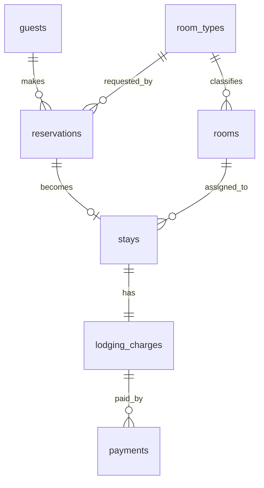

# DB設計

- 本ドキュメントでは、HRS のドメイン概念を Postgres のテーブルとして整理する。
- 実装では `Prisma` を使い、`schema.prisma` を DB スキーマの正とする。

## ER構造



予約は「部屋タイプ」に対して作成する。具体的な「部屋」はチェックイン時に `stays` に割り当てる。

## UMLからDB設計への導出方針

DB設計は、ドメイン分析・システム分析の UML をそのまま機械的にテーブル化するのではなく、ユースケースを実現するために永続化が必要な情報へ絞って導出する。

| UML上の要素 | DB設計での扱い | 判断理由 |
| --- | --- | --- |
| Entity クラス | 原則としてテーブル候補にする | 予約、部屋、宿泊などはユースケースをまたいで状態を保持するため |
| Boundary クラス | テーブルにしない | 画面やフォームは表示・入力の責務であり、永続化対象ではないため |
| Control クラス | テーブルにしない | 処理手順を表すクラスであり、実装ではサービスや関数に対応するため |
| 属性 | カラム候補にする | ユースケース実行後も保持・検索・表示する値を保存するため |
| 関連 | 外部キーにする | オブジェクト間の参照関係をDB上で整合させるため |
| 多重度 `1` | `not null` または一意制約で表す | 必ず1件存在する関係や最大1件の関係をDB制約で守るため |
| 多重度 `0..1` | nullable または一意制約で表す | チェックアウト前の `checked_out_at` のように未発生状態を許すため |
| 多重度 `1..*` / `0..*` | 子テーブル側の外部キーで表す | 1人の利用者が複数予約を持つなど、親子関係を自然に表せるため |
| 状態 | enum にする | 予約状態の取り得る値を限定し、状態遷移の検証をしやすくするため |
| 派生値 | 保存しないか、確定時だけ保存する | 概算料金は計算値だが、チェックアウト後の請求金額は履歴として保存する必要があるため |

### 主要概念の導出理由

| ドメイン概念 | DBテーブル | 導出理由 |
| --- | --- | --- |
| 利用者 | `guests` | 予約者の氏名・連絡先は予約確認や連絡先照合で使うため保存する |
| 予約 | `reservations` | 予約番号、宿泊予定、人数、状態は予約確認・チェックイン・キャンセルで継続的に使うため保存する |
| 部屋タイプ | `room_types` | 空室検索と料金計算で使うマスタ情報であり、複数の部屋と予約から参照されるため分離する |
| 部屋 | `rooms` | チェックイン時に実客室を割り当て、二重割当を避ける必要があるため保存する |
| 宿泊 | `stays` | チェックイン/チェックアウトの実績を予約とは分けて保持するため保存する |
| 宿泊料金 | `lodging_charges` | チェックアウト時に確定した請求金額を後から再現できるよう保存する |
| 支払い | `payments` | 支払方法・金額・日時を請求とは分けて記録するため保存する |

### 正規化と実装都合の判断

- 予約時点では部屋番号を確定せず、`reservations.room_type_id` に希望部屋タイプだけを保存する。具体的な部屋はチェックイン時に `stays.room_id` として保存する。
- `guests` は利用者アカウントではなく、予約ごとの予約者情報として扱う。初期実装では `users`、`sessions`、`roles` は作らない。
- 予約番号は利用者に提示する識別子なので `reservations.reservation_number` として内部IDから分ける。
- 宿泊料金は `room_types.base_rate * 泊数` で計算できるが、チェックアウト後の請求履歴として `lodging_charges.amount` に保存する。
- 支払いは初期実装では1件でも足りるが、請求と支払いを分けておくと分割払いや支払い失敗の拡張に対応しやすい。

## テーブル一覧

[ドメイン分析](../domain-analysis/class-diagram.md)で抽出した主要な `Entity` をDBテーブルの出発点にし、ユースケースを実現できるようにリレーションと制約を調整した。

| テーブル | 対応概念 | 説明 |
| --- | --- | --- |
| `guests` | 利用者 | 予約者の氏名と連絡先 |
| `room_types` | 部屋タイプ | 種別名、定員、基本宿泊料 |
| `rooms` | 部屋 | 個別の客室番号と部屋タイプ |
| `reservations` | 予約 | 予約番号、宿泊予定、人数、状態 |
| `stays` | 宿泊 | チェックイン/チェックアウト実績と割当部屋 |
| `lodging_charges` | 宿泊料金 | 宿泊に対する請求金額 |
| `payments` | 支払い | 宿泊料金に対する支払い |

## 共通カラム方針

- 主キーは Prisma の扱いやすさを優先し、文字列ID (`String @id @default(cuid())`) とする。
- 画面に表示する予約識別子は `reservations.reservation_number` とし、内部IDとは分ける。
- 作成日時 `created_at` と更新日時 `updated_at` は主要テーブルに持たせる。
- 金額は整数の円単位で保存する。
- 日付だけで扱う宿泊予定は `DateTime` にせず、実装時は Postgres の `date` 型に対応させる。

## `guests`

- 利用者アカウントは扱わず、予約ごとに入力された予約者情報を保存する方針
- 連絡先は予約登録時の入力に合わせ、`email`（必須）と `phone`（省略可）の2フィールドで管理する
- 本人確認（予約照会・チェックイン・キャンセル）は `name` の照合で行い、`email`・`phone` は照合キーとして使わない

| カラム | 型 | 制約 | 説明 |
| --- | --- | --- | --- |
| `id` | string | PK | 内部ID |
| `name` | string | not null | 氏名（「姓 名」形式で保存） |
| `email` | string | not null | メールアドレス（予約確認・各種通知メール送信先） |
| `phone` | string | nullable | 電話番号（省略可） |
| `created_at` | datetime | not null | 作成日時 |
| `updated_at` | datetime | not null | 更新日時 |


## `room_types`

| カラム | 型 | 制約 | 説明 |
| --- | --- | --- | --- |
| `id` | string | PK | 内部ID |
| `name` | string | unique, not null | 種別名 |
| `capacity` | integer | not null | 定員 |
| `base_rate` | integer | not null | 1泊あたりの基本宿泊料 |
| `created_at` | datetime | not null | 作成日時 |
| `updated_at` | datetime | not null | 更新日時 |

- `capacity > 0`、`base_rate >= 0` を制約とする。

## `rooms`

| カラム | 型 | 制約 | 説明 |
| --- | --- | --- | --- |
| `id` | string | PK | 内部ID |
| `room_number` | string | unique, not null | 部屋番号 |
| `room_type_id` | string | FK, not null | 部屋タイプID |
| `created_at` | datetime | not null | 作成日時 |
| `updated_at` | datetime | not null | 更新日時 |

- チェックイン時には、予約の部屋タイプに属し、対象期間に他の宿泊へ割り当てられていない部屋を選ぶ。

## `reservations`

- 予約番号は `HRS-YYYYMMDD-連番` のように、人が読める形式で発行する。
- 連番採番の衝突は DB の一意制約と再試行で防ぐ。

| カラム | 型 | 制約 | 説明 |
| --- | --- | --- | --- |
| `id` | string | PK | 内部ID |
| `reservation_number` | string | unique, not null | 利用者に提示する予約番号 |
| `guest_id` | string | FK, not null | 利用者ID |
| `room_type_id` | string | FK, not null | 希望部屋タイプID |
| `check_in_date` | date | not null | チェックイン予定日 |
| `check_out_date` | date | not null | チェックアウト予定日 |
| `guest_count` | integer | not null | 宿泊人数 |
| `status` | enum | not null | 予約状態 |
| `created_at` | datetime | not null | 作成日時 |
| `updated_at` | datetime | not null | 更新日時 |

## `stays`

| カラム | 型 | 制約 | 説明 |
| --- | --- | --- | --- |
| `id` | string | PK | 内部ID |
| `reservation_id` | string | unique, FK, not null | 対応する予約ID |
| `room_id` | string | FK, not null | 割り当てた部屋ID |
| `checked_in_at` | datetime | not null | チェックイン日時 |
| `checked_out_at` | datetime | nullable | チェックアウト日時 |
| `created_at` | datetime | not null | 作成日時 |
| `updated_at` | datetime | not null | 更新日時 |

1つの予約から作成できる宿泊は最大1件とするため、`reservation_id` に一意制約を置く。

## `lodging_charges`

| カラム | 型 | 制約 | 説明 |
| --- | --- | --- | --- |
| `id` | string | PK | 内部ID |
| `stay_id` | string | unique, FK, not null | 宿泊ID |
| `amount` | integer | not null | 請求金額 |
| `created_at` | datetime | not null | 作成日時 |
| `updated_at` | datetime | not null | 更新日時 |

現時点では、料金は `room_types.base_rate * 泊数` で計算する。割引、追加料金、税を扱う場合は別テーブルを追加する。

## `payments`

| カラム | 型 | 制約 | 説明 |
| --- | --- | --- | --- |
| `id` | string | PK | 内部ID |
| `lodging_charge_id` | string | FK, not null | 宿泊料金ID |
| `amount` | integer | not null | 支払金額 |
| `paid_at` | datetime | not null | 支払日時 |
| `method` | string | not null | 支払方法 |
| `created_at` | datetime | not null | 作成日時 |
| `updated_at` | datetime | not null | 更新日時 |

分割払いを許すため、1つの宿泊料金に対して複数の支払いを持てる。今回のチェックアウトAPIでは、請求金額と同額の支払い1件を登録する。

## 列挙型

| 値 | 説明 |
| --- | --- |
| `RESERVED` | 予約済 |
| `CHECKED_IN` | チェックイン済 |
| `CHECKED_OUT` | チェックアウト済 |
| `CANCELLED` | 取消済 |

`CANCELLED` は予約キャンセル要求に対応するため保持する。予約キャンセル API は [API設計](api-design.md) に定義する。

## 制約とインデックス

| 対象 | 制約 |
| --- | --- |
| `reservations.reservation_number` | 一意 |
| `rooms.room_number` | 一意 |
| `room_types.name` | 一意 |
| `stays.reservation_id` | 一意 |
| `lodging_charges.stay_id` | 一意 |
| `reservations.check_in_date`, `reservations.check_out_date` | `check_in_date < check_out_date` |
| `reservations.guest_count` | `guest_count > 0` |
| `room_types.capacity` | `capacity > 0` |
| `room_types.base_rate`, `lodging_charges.amount`, `payments.amount` | `0` 以上 |

空室検索では `reservations(room_type_id, check_in_date, check_out_date, status)` と `stays(room_id, checked_in_at, checked_out_at)` にインデックスを置く。

## トランザクションが必要な処理

トランザクション境界と競合時の扱いの詳細は [トランザクション・競合制御設計](transaction-concurrency-design.md) に従う。

| 処理 | 理由 |
| --- | --- |
| 予約作成 | 空室確認と予約登録の間で競合が起きる可能性がある |
| チェックイン | 部屋割当、宿泊作成、予約状態更新を一体で確定する必要がある |
| チェックアウト | 宿泊終了、料金作成、支払い作成、予約状態更新を一体で確定する必要がある |
| 予約キャンセル | 予約状態更新と以後のチェックイン不可を一体で扱う必要がある |

## Prismaモデル案

```prisma
enum ReservationStatus {
  RESERVED
  CHECKED_IN
  CHECKED_OUT
  CANCELLED
}

model Guest {
  id           String        @id @default(cuid())
  name         String
  email        String
  phone        String?
  reservations Reservation[]
  createdAt    DateTime      @default(now()) @map("created_at")
  updatedAt    DateTime      @updatedAt @map("updated_at")

  @@map("guests")
}

model RoomType {
  id           String        @id @default(cuid())
  name         String        @unique
  capacity     Int
  baseRate     Int           @map("base_rate")
  rooms        Room[]
  reservations Reservation[]
  createdAt    DateTime      @default(now()) @map("created_at")
  updatedAt    DateTime      @updatedAt @map("updated_at")

  @@map("room_types")
}

model Room {
  id         String   @id @default(cuid())
  roomNumber String   @unique @map("room_number")
  roomTypeId String   @map("room_type_id")
  roomType   RoomType @relation(fields: [roomTypeId], references: [id])
  stays      Stay[]
  createdAt  DateTime @default(now()) @map("created_at")
  updatedAt  DateTime @updatedAt @map("updated_at")

  @@map("rooms")
}

model Reservation {
  id                String            @id @default(cuid())
  reservationNumber String            @unique @map("reservation_number")
  guestId           String            @map("guest_id")
  guest             Guest             @relation(fields: [guestId], references: [id])
  roomTypeId        String            @map("room_type_id")
  roomType          RoomType          @relation(fields: [roomTypeId], references: [id])
  checkInDate       DateTime          @map("check_in_date") @db.Date
  checkOutDate      DateTime          @map("check_out_date") @db.Date
  guestCount        Int               @map("guest_count")
  status            ReservationStatus @default(RESERVED)
  stay              Stay?
  createdAt         DateTime          @default(now()) @map("created_at")
  updatedAt         DateTime          @updatedAt @map("updated_at")

  @@index([roomTypeId, checkInDate, checkOutDate, status])
  @@map("reservations")
}

model Stay {
  id            String           @id @default(cuid())
  reservationId String           @unique @map("reservation_id")
  reservation   Reservation      @relation(fields: [reservationId], references: [id])
  roomId        String           @map("room_id")
  room          Room             @relation(fields: [roomId], references: [id])
  checkedInAt   DateTime         @map("checked_in_at")
  checkedOutAt  DateTime?        @map("checked_out_at")
  charge        LodgingCharge?
  createdAt     DateTime         @default(now()) @map("created_at")
  updatedAt     DateTime         @updatedAt @map("updated_at")

  @@index([roomId, checkedInAt, checkedOutAt])
  @@map("stays")
}

model LodgingCharge {
  id        String    @id @default(cuid())
  stayId    String    @unique @map("stay_id")
  stay      Stay      @relation(fields: [stayId], references: [id])
  amount    Int
  payments  Payment[]
  createdAt DateTime  @default(now()) @map("created_at")
  updatedAt DateTime  @updatedAt @map("updated_at")

  @@map("lodging_charges")
}

model Payment {
  id              String         @id @default(cuid())
  lodgingChargeId String         @map("lodging_charge_id")
  lodgingCharge   LodgingCharge  @relation(fields: [lodgingChargeId], references: [id])
  amount          Int
  paidAt          DateTime       @map("paid_at")
  method          String
  createdAt       DateTime       @default(now()) @map("created_at")
  updatedAt       DateTime       @updatedAt @map("updated_at")

  @@map("payments")
}
```

## 未確定事項

- Postgres の CHECK 制約は Prisma の標準スキーマだけでは表現しにくいため、実装時にマイグレーションSQLで追加するか、アプリケーション層の検証に寄せるかを決める。
- 支払い方法を列挙型にするか、文字列のままにするかは実装時に決める。
- 初期実装ではログイン、セッション、ロールを扱わないため、`users`、`sessions`、`roles` は追加しない。利用者アカウントや管理者アカウントを追加する場合は、`guests` とログインユーザーの関係を再設計する。
