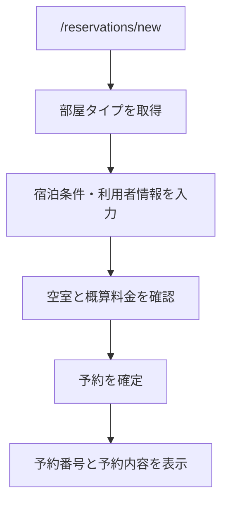
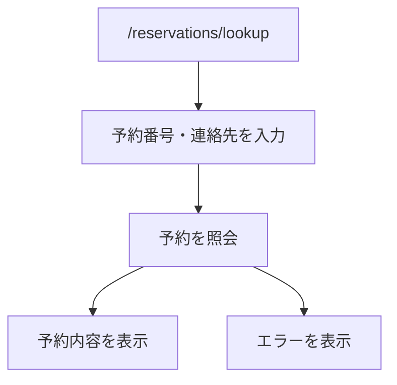
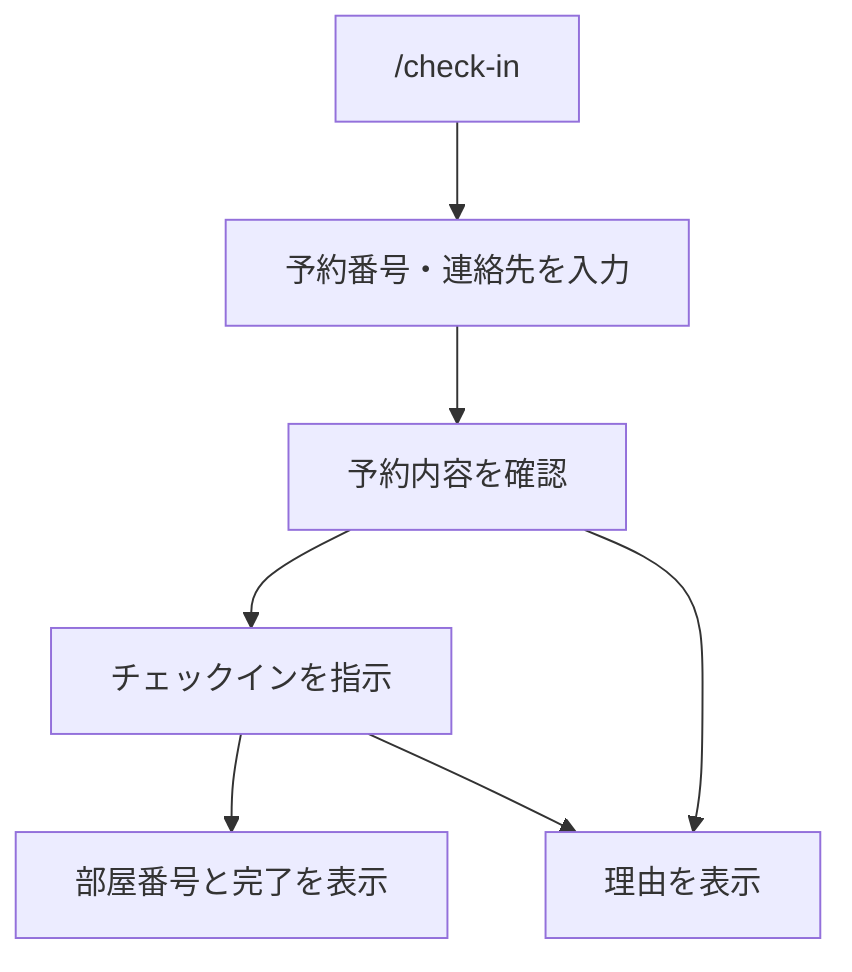
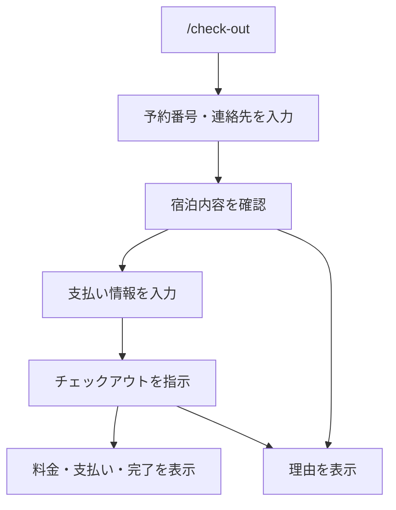

# 画面構成・ルーティング設計

- 対象 Issue: [#15](https://github.com/97kuek/HRS/issues/15)
- 前提: [API設計](api-design.md), [認証・認可設計](auth-design.md)
- 状態: **ドラフト**（[#14 システム分析レビュー](https://github.com/97kuek/HRS/issues/14) 後に見直す）

HRS の利用者向け画面、画面遷移、API呼び出しの対応を定義する。Next.js App Router を前提に、ページは利用者の操作単位で分ける。

## 基本方針

- 初期実装では利用者向けセルフサービス画面だけを作る。
- 管理者、受付係、会員マイページは現行スコープ外とする。
- 画面は API の結果表示とフォーム送信を担当し、業務ルールは API 側へ委譲する。
- 予約確認、チェックイン、チェックアウトでは予約番号と連絡先を入力させる。
- 予約番号は利用者に提示する識別子として URL に含めてもよいが、連絡先は URL に含めない。

## 画面一覧

| ルート | 画面 | 主な役割 |
| --- | --- | --- |
| `/` | ホーム | 予約、予約確認、チェックイン、チェックアウトへの導線 |
| `/reservations/new` | 予約作成 | 宿泊条件、利用者情報、部屋タイプを入力し予約を作成する |
| `/reservations/[reservationNumber]` | 予約結果・予約詳細 | 予約作成後または本人確認後に予約内容を表示する |
| `/reservations/lookup` | 予約確認 | 予約番号と連絡先を入力し予約内容を確認する |
| `/check-in` | チェックイン | 予約番号と連絡先を入力し、予約内容確認後にチェックインする |
| `/check-out` | チェックアウト | 予約番号と連絡先を入力し、支払い情報を入力してチェックアウトする |

`/reservations/[reservationNumber]` は直接アクセス時に連絡先を持たないため、予約詳細を表示する前に `/reservations/lookup` へ誘導する。

## 画面と API の対応

| 画面 | 呼び出す API | 備考 |
| --- | --- | --- |
| `/reservations/new` | `GET /api/room-types`, `GET /api/availability`, `POST /api/reservations` | 予約作成後に予約番号を表示する |
| `/reservations/lookup` | `POST /api/reservations/lookup` | 連絡先は本文で送る |
| `/check-in` | `POST /api/reservations/lookup`, `POST /api/reservations/{reservationNumber}/check-in` | 予約内容確認後に実行ボタンを表示する |
| `/check-out` | `POST /api/reservations/lookup`, `POST /api/reservations/{reservationNumber}/check-out` | 支払金額と方法を入力する |

## 予約作成フロー

予約作成後は、予約番号と連絡先が今後の本人確認に必要であることを画面上で明確に表示する。

## 予約確認フロー

本人確認失敗時は、予約番号が存在しないのか連絡先が違うのかを区別せずに表示する。

## チェックインフロー

チェックイン実行前に、予約日、宿泊人数、部屋タイプを確認できるようにする。

## チェックアウトフロー

初期実装では外部決済を行わず、支払い方法と支払金額の記録だけを行う。

## コンポーネント責務

| コンポーネント | 責務 |
| --- | --- |
| `ReservationForm` | 宿泊条件、利用者情報、部屋タイプを入力する |
| `AvailabilityResult` | 空室候補と概算料金を表示する |
| `ReservationResult` | 予約番号と予約内容を表示する |
| `ReservationAccessForm` | 予約番号と連絡先を入力する |
| `ReservationDetail` | 予約内容、状態、部屋番号を表示する |
| `CheckInForm` | 本人確認済み予約に対してチェックインを指示する |
| `CheckOutForm` | 支払い情報を入力しチェックアウトを指示する |
| `ApiErrorMessage` | APIエラーを利用者向け文言で表示する |

## 表示状態

| 状態 | 表示方針 |
| --- | --- |
| 初期 | 必要な入力フォームを表示する |
| 送信中 | 二重送信を防ぐため送信ボタンを無効化する |
| 成功 | 次に必要な操作や予約番号を表示する |
| 入力エラー | 該当フィールドの近くに表示する |
| 業務エラー | 画面上部または操作ボタン付近に理由を表示する |
| 想定外エラー | 再試行を促す一般的なメッセージを表示する |

## 未確定事項

- `/` を簡易メニューにするか、予約作成画面へリダイレクトするかは実装時に決める。
- 予約作成後の詳細画面で連絡先をどの程度表示するかは、プライバシー観点で実装時に調整する。
- 管理者や受付係を追加する場合は、利用者向けルートと管理者向けルートを分ける。
