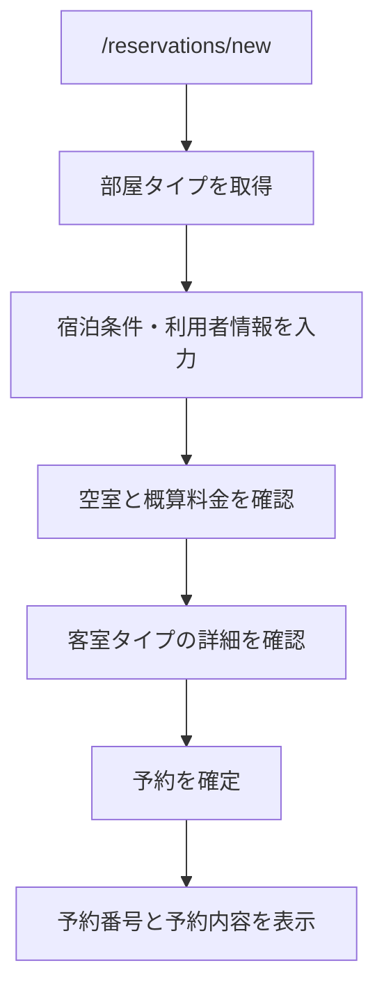
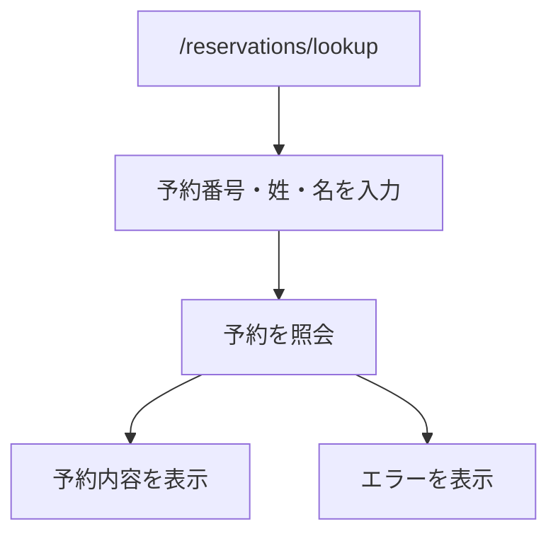
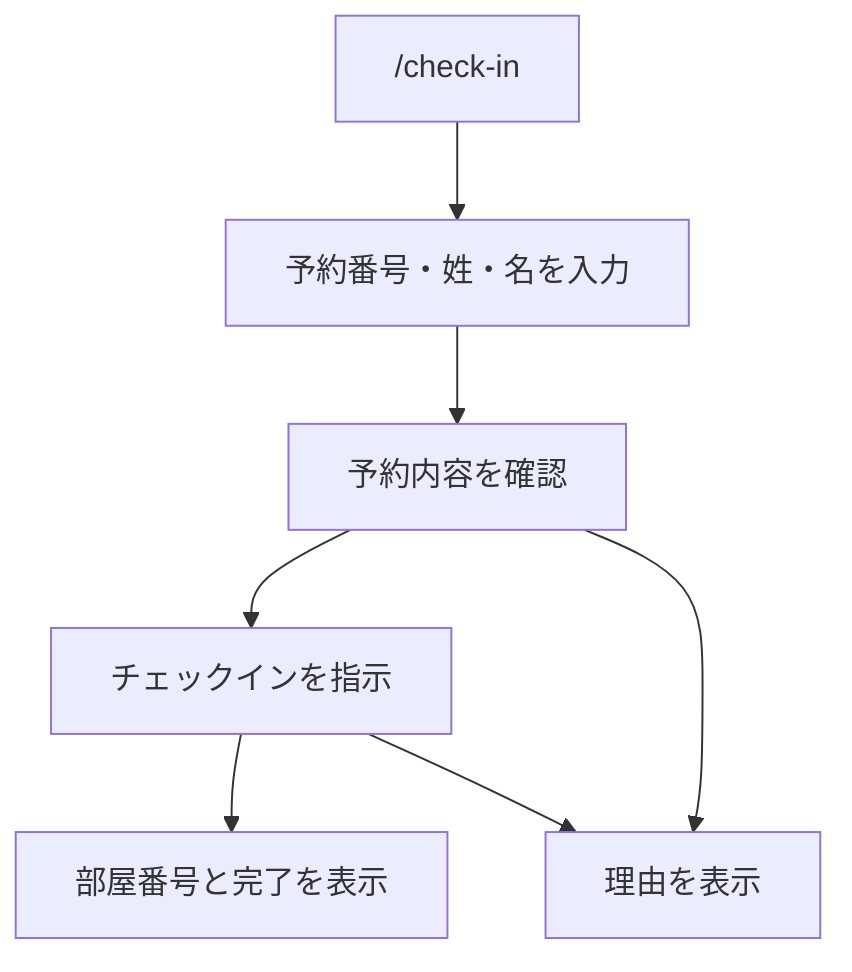
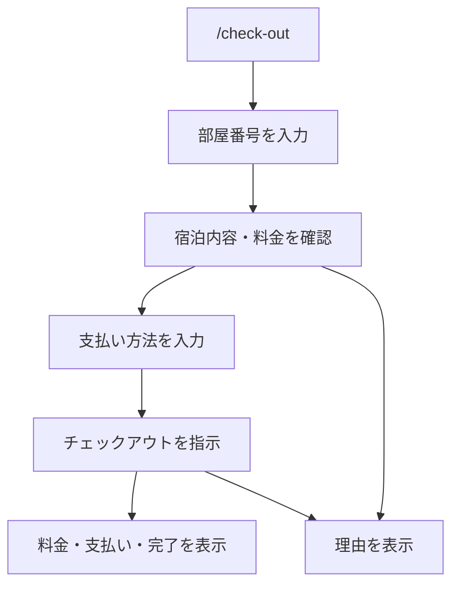
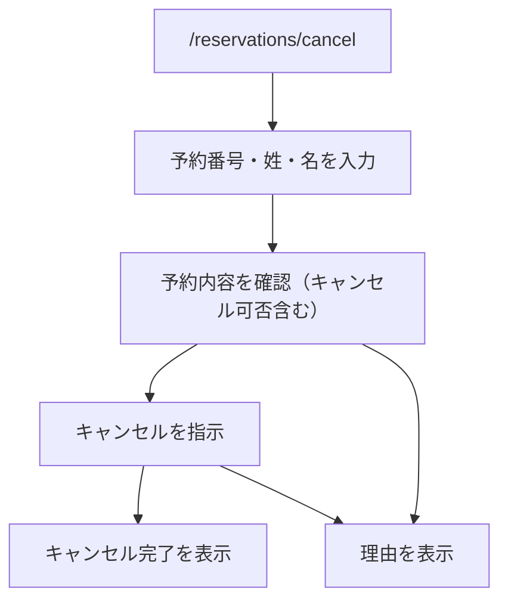

# 画面構成・ルーティング設計

- HRS の利用者向け画面、画面遷移、API呼び出しの対応を定義するドキュメント
- Next.js App Router を前提に、ページは利用者の操作単位で分ける

## 基本方針

- 初期実装では利用者向けセルフサービス画面だけを作る
- **管理者、受付係、会員マイページは現行スコープ外**とする
- 画面は API の結果表示とフォーム送信を担当し、業務ルールは API 側へ委譲する。
- 予約確認・チェックイン・キャンセルでは**予約番号と氏名（姓・名）**を入力させる。
- チェックアウトでは**部屋番号**を入力させる（予約番号・氏名は不要）。
- 予約番号は利用者に提示する識別子として URL に含めてもよい。
- 初期実装ではログイン状態に依存するページは作らない。

## CSR / SSR / SSG の使い分け

Next.js App Router では、画面ごとにデータの性質で描画方式を分ける。ここでいう SSG は静的生成を指す。授業メモなどで SGR と書かれている場合は、ここでは SSG として扱う。

CSR で取得した API レスポンスやクライアント状態は、ブラウザの開発者ツールから見える前提で扱う。そのため、顧客情報や内部IDを含む処理を「CSRだから安全」とは考えない。初期実装では、入力フォームの操作性にはクライアントコンポーネントを使ってよいが、予約照会、チェックイン、チェックアウト、キャンセルなどの予約状態を読む・変える処理は Route Handler または Server Action 側で実行し、ブラウザへ返すデータを表示に必要な最小限にする。

| 方式 | 使う場面 | HRSでの対象 | 理由 |
| --- | --- | --- | --- |
| SSG | 利用者ごとに変わらない静的な画面 | `/` のメニュー、説明だけの画面 | ビルド時に生成でき、DBアクセスが不要なため |
| SSR | 初回表示時点でサーバー側データが必要な画面 | 予約詳細をサーバー側で表示する場合 | DBアクセスや内部IDをサーバー側に閉じ、HTMLに出す情報を最小化できるため |
| CSR | 入力中のUI状態や送信中表示を扱う画面部品 | 予約条件フォーム、空室検索フォーム、確認ボタン、エラー表示 | 入力内容に応じて表示が変わり、送信中・エラー・成功表示を同じ画面で扱いやすいため |
| Server Action / Route Handler | 予約照会や状態変更など、DBアクセスと業務ルールを伴う処理 | 予約確認、予約作成、チェックイン、チェックアウト、キャンセル | 顧客情報、予約状態、支払い情報、内部IDをサーバー側に閉じ、ブラウザへ返すデータを制御するため |
| ISR | 初期実装では使わない | なし | 客室在庫や予約状態は即時性が必要で、再生成間隔つきキャッシュと相性が悪いため |

初期実装の基本は「静的に出せる入口は SSG、フォームの操作性は CSR、予約データの取得・更新は Route Handler または Server Action」で分ける。予約内容や宿泊状態を含むデータは、画面ビルド時に埋め込まず、ブラウザへ返す場合も表示に必要な項目だけにする。

### ブラウザへ返すデータの最小化

| 返してよい情報 | 返さない情報 |
| --- | --- |
| 予約番号、予約状態、部屋タイプ名、宿泊予定日、泊数、宿泊人数、割当済みの部屋番号、支払結果の概要 | `guestId`, `reservationId`, `stayId`, DB内部ID、連絡先、作成日時、更新日時、内部メモ、サーバーログ、SQLエラー |

利用者がフォームに入力した連絡先は、その利用者自身のブラウザ上では見える。設計上避けるべきなのは、APIが連絡先や内部IDを不要にレスポンスへ含めたり、URL、ログ、HTMLに残したりすることである。

### 画面別の描画方針

| ルート | 描画方針 | 理由 |
| --- | --- | --- |
| `/` | SSG | 固定メニューであり、DBに依存しないため |
| `/reservations/new` | CSR + Route Handler / Server Action | 入力UIはCSRで扱い、空室確認と予約作成はサーバー側で実行するため |
| `/reservations/lookup` | CSR + Route Handler / Server Action | 入力UIはCSRで扱い、予約照会はサーバー側で実行し、返却項目を最小化するため |
| `/reservations/[reservationNumber]` | SSR または照会画面へ誘導 | 予約詳細を直接表示する場合はサーバー側で取得し、連絡先や内部IDをHTMLへ出さないため |
| `/check-in` | CSR + Route Handler / Server Action | 入力UIはCSRで扱い、予約状態確認とチェックイン更新はサーバー側で実行するため |
| `/check-out` | CSR + Route Handler / Server Action | 入力UIはCSRで扱い、料金計算、支払い記録、状態更新はサーバー側で実行するため |
| `/reservations/cancel` | CSR + Route Handler / Server Action | 入力UIはCSRで扱い、予約状態確認とキャンセル更新はサーバー側で実行するため |

## 画面一覧

| ルート | 画面 | 主な役割 |
| --- | --- | --- |
| `/` | ホーム | 予約、予約確認、チェックイン、チェックアウトへの導線 |
| `/reservations/new` | 予約作成 | 宿泊条件、利用者情報、部屋タイプを入力し予約を作成する |
| `/reservations/[reservationNumber]` | 予約結果・予約詳細 | 予約作成後または予約情報照合後に予約内容を表示する |
| `/reservations/lookup` | 予約確認 | 予約番号と連絡先を入力し予約内容を確認する |
| `/check-in` | チェックイン | 予約番号と連絡先を入力し、予約内容確認後にチェックインする |
| `/check-out` | チェックアウト | 予約番号と連絡先を入力し、支払い情報を入力してチェックアウトする |
| `/reservations/cancel` | 予約キャンセル | 予約番号と連絡先を入力し、予約内容確認後にキャンセルする |

`/reservations/[reservationNumber]` は直接アクセス時に連絡先を持たないため、予約詳細を表示する前に `/reservations/lookup` へ誘導する。

## 画面と API の対応

| 画面 | 呼び出す API | 備考 |
| --- | --- | --- |
| `/reservations/new` | `GET /api/room-types`, `GET /api/availability`, `POST /api/reservations` | 予約作成後に予約番号を表示する |
| `/reservations/lookup` | `GET /api/reservations/{reservationNumber}` | 予約番号と氏名（姓・名）で照会する |
| `/check-in` | `GET /api/reservations/{reservationNumber}`, `POST /api/reservations/{reservationNumber}/check-in` | 予約内容確認後にチェックイン実行ボタンを表示する |
| `/check-out` | `GET /api/rooms/{roomNumber}/check-out/quote`, `POST /api/rooms/{roomNumber}/check-out` | 部屋番号を入力→料金確認→支払い方法入力→確定 |
| `/reservations/cancel` | `GET /api/reservations/{reservationNumber}/cancel/quote`, `POST /api/reservations/{reservationNumber}/cancel` | 予約内容確認後にキャンセルする |

## 予約作成フロー

予約作成後は、予約番号と連絡先が今後の予約照会に必要であることを画面上で明確に表示する。

## 予約確認フロー

予約番号と氏名の照合失敗時は、予約番号が存在しないのか氏名が違うのかを区別せずに表示する。

## チェックインフロー

チェックイン実行前に、予約日、宿泊人数、部屋タイプを確認できるようにする。チェックインはチェックイン予定日当日のみ実行できる。

## チェックアウトフロー

初期実装では外部決済を行わず、支払い方法（現金 / クレジットカード）と支払金額の記録だけを行う。

## 予約キャンセルフロー

キャンセル実行前に、宿泊日、宿泊人数、部屋タイプとキャンセル可否を確認できるようにする。チェックイン済みまたはチェックアウト済みの予約はキャンセル不可として扱う。

## コンポーネント責務

実装は各ページ (`page.tsx`) にインライン記述する方針で進めており、独立した汎用コンポーネントへの分割は将来の拡張時に検討する。主な画面と責務は以下の通り。

| ページ | 主な責務 |
| --- | --- |
| `/reservations/new/page.tsx` | 宿泊条件・利用者情報（氏名・メール・電話）・部屋タイプを入力し予約を作成する |
| `/reservations/lookup/page.tsx` | 予約番号・姓・名を入力し予約内容を表示する |
| `/check-in/page.tsx` | 予約番号・姓・名を入力し、予約内容確認後にチェックインを実行する |
| `/check-out/page.tsx` | 部屋番号を入力し、料金確認後に支払い方法を選択してチェックアウトを実行する |
| `/reservations/cancel/page.tsx` | 予約番号・姓・名を入力し、キャンセル可否確認後にキャンセルを実行する |

## 表示状態

| 状態 | 表示方針 |
| --- | --- |
| 初期 | 必要な入力フォームを表示する |
| 送信中 | 二重送信を防ぐため送信ボタンを無効化する |
| 成功 | 次に必要な操作や予約番号を表示する |
| 入力エラー | 該当フィールドの近くに表示する |
| 業務エラー | 画面上部または操作ボタン付近に理由を表示する |
| 想定外エラー | 再試行を促す一般的なメッセージを表示する |

## 未確定事項

- `/` を簡易メニューにするか、予約作成画面へリダイレクトするかは実装時に決める。
- 予約作成後の詳細画面で連絡先をどの程度表示するかは、プライバシー観点で実装時に調整する。
- 管理者や受付係を追加する場合は、利用者向けルートと管理者向けルートを分ける。
