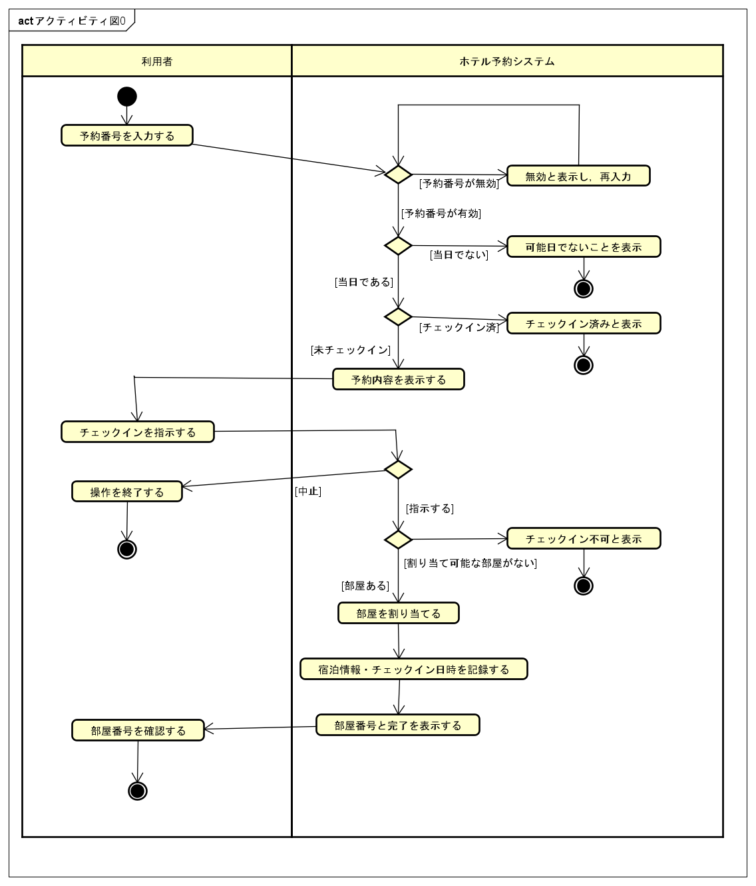

# ユースケース記述: チェックインする

## 概要

| 項目 | 内容 |
| --- | --- |
| ユースケース名 | チェックインする |
| 主アクター | 利用者 |
| 関係者 | なし（セルフサービス前提。ホテルスタッフはシステムに直接関与しない） |
| 目的 | 利用者が予約に基づいてチェックインし，実際の部屋の割り当てを受ける |
| 事前条件 | HRSが利用可能であり，利用者が有効な予約を保有している |
| 事後条件 | 宿泊が開始され，HRSに宿泊情報とチェックイン日時，割り当てられた部屋が記録されている |
| 失敗時の事後条件 | 宿泊は開始されず，部屋は割り当てられない。利用者にチェックインできない理由が示されている |

## 基本系列

1. 利用者が予約番号を入力する。
2. HRSが予約番号の妥当性を確認する。
3. HRSが予約内容（宿泊日，部屋タイプ，宿泊人数）を表示する。
4. 利用者がチェックインを指示する。
5. HRSが予約された部屋タイプの中から空いている部屋を割り当てる。
6. HRSが宿泊情報を記録し，チェックイン日時を記録する。
7. HRSが割り当てられた部屋番号とチェックイン完了を表示する。

## 代替系列

### A1: 利用者がチェックインを取りやめる

3a. 利用者が予約内容を確認し，チェックインの中止を指示する。  
3b. HRSは宿泊情報を記録せず，チェックイン操作を終了する。

## 例外系列

### E1: 予約番号が無効である

2a. HRSが入力された予約番号に該当する予約を見つけられない。  
2b. HRSが予約番号が無効であることを表示し，再入力を促す。  
2c. ユースケースは基本系列1に戻る。

### E2: 当日がチェックイン可能日でない

2a. HRSが予約の宿泊開始日と当日が一致しないことを検出する。  
2b. HRSがチェックイン可能日ではないことと，チェックイン可能日を表示する。  
2c. HRSは宿泊情報を記録せず，チェックイン操作を終了する。

### E3: 予約が既にチェックイン済みである

2a. HRSが予約が既にチェックイン済みであることを検出する。  
2b. HRSが既にチェックイン済みであることを表示する。  
2c. HRSは宿泊情報を新たに記録せず，チェックイン操作を終了する。

### E4: 割り当て可能な部屋がない

5a. HRSが予約された部屋タイプに空いている部屋を見つけられない。  
5b. HRSがチェックインできないことと理由を表示する。  
5c. HRSは宿泊情報を記録せず，チェックイン操作を終了する。

## アクティビティ図

