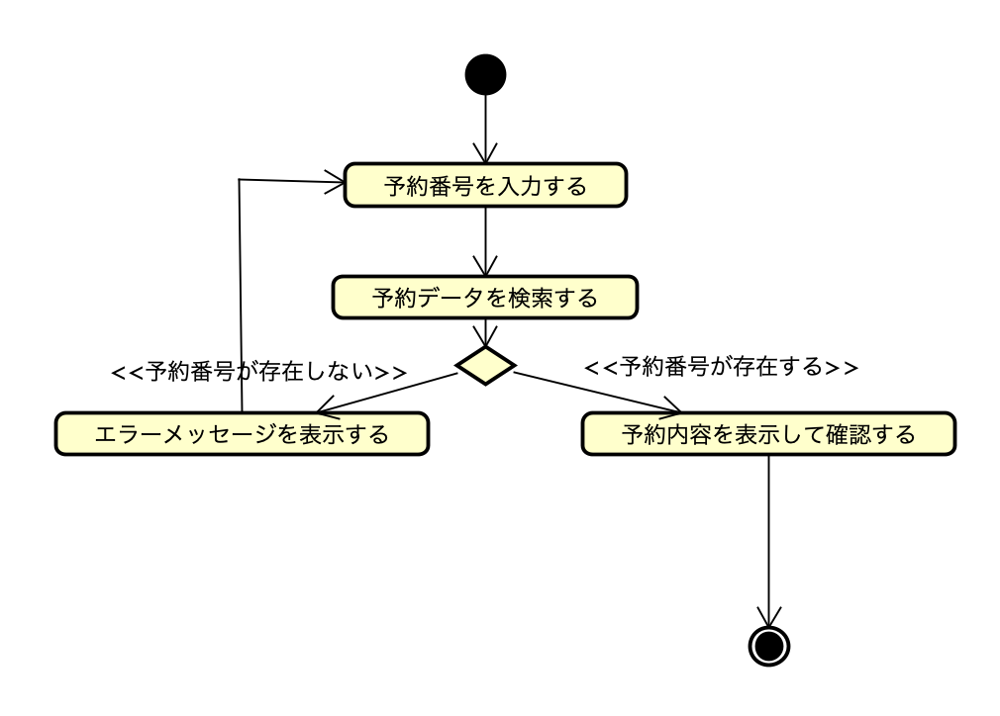

# ユースケース記述: 予約を確認する

## 概要

| 項目 | 内容 |
| --- | --- |
| ユースケース名 | 予約を確認する |
| 主アクター | 利用者 |
| 関係者 | なし（セルフサービス前提） |
| 目的 | 利用者が予約番号から自身の予約内容を確認できる |
| 事前条件 | 予約が完了し、予約番号が発行されている |
| 事後条件 | 利用者が予約内容を確認できている |
| 失敗時の事後条件 | 予約内容は表示されず、利用者に該当する予約が無いことが示されている |

## 基本系列

1. 利用者が予約番号を入力する。
2. HRSが該当する予約内容（宿泊日程、部屋タイプ、宿泊人数等）を表示する。
3. 利用者が表示された予約内容を確認する。

## 代替系列

なし

## 例外系列

### E1: 予約番号が存在しない

2a. HRSが入力された予約番号に該当する予約データが存在しないことを検出する。  
2b. HRSがエラーメッセージを表示する。  
2c. ユースケースは基本系列1に戻る。

## アクティビティ図

例外系列 E1 を、エラーメッセージ表示後に最初の「予約番号を入力する」アクションへループさせて表現している。

## 補足

- 「予約番号が存在しない場合」は目的を達成できずに終わる振る舞いのため、代替系列ではなく**例外系列**として定義した。
- 作図ツール: **Astah**。正本は `アクティビティ図_予約を確認する.asta`（図は同名 `.png` に書き出す）※ `.asta` は後続コミットで追加予定。
